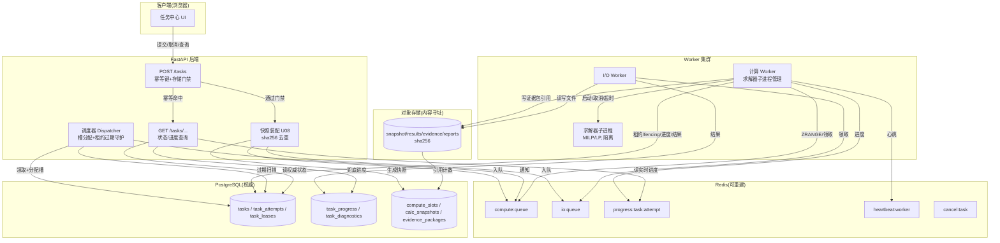
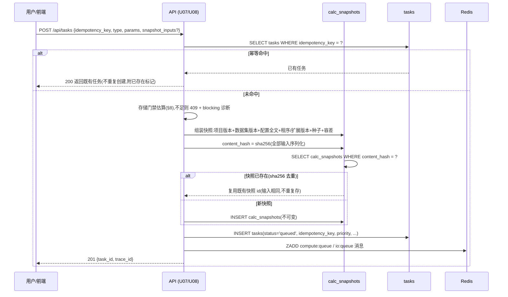
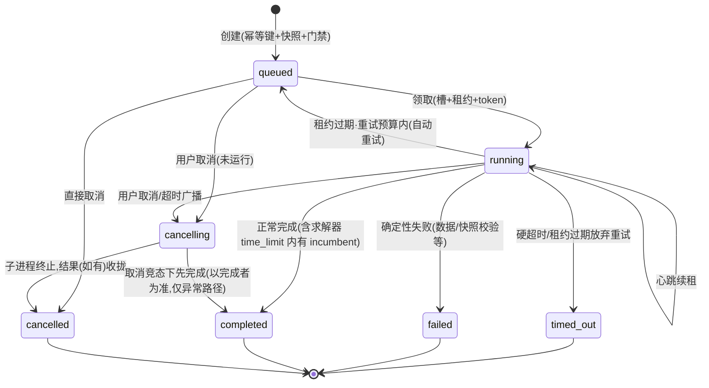
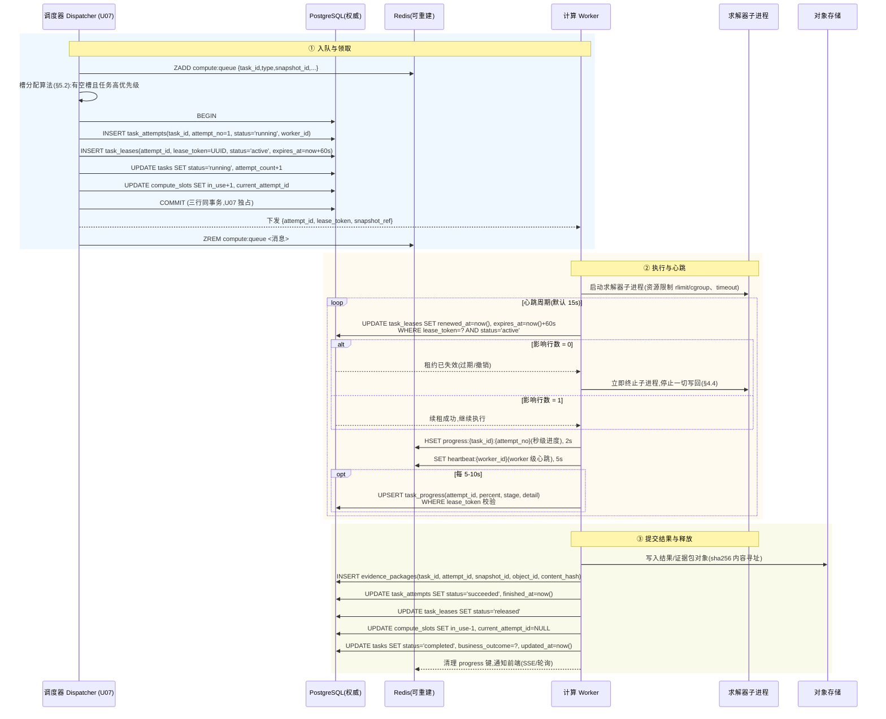

# 03 任务调度与分布式一致性规格

> 版本: 0.1(草案)
> 状态: 设计规格
> 适用范围: IES Plan 综合能源规划软件(任务调度器 / 计算 Worker / I/O Worker / 并发槽 / 租约协议)
> 配套文档: docs/spec/ 系列(01 数据库 schema、02 计算模型、04 受控注册表与诊断体系)

---

## 0. 定位、术语与统一基准

### 0.1 文档定位

本文档定义 IES Plan 的**任务调度与分布式一致性协议**:任务从提交、排队、领取、执行、取消、超时、失败到终态的完整生命周期,以及多 Worker 并发执行时的权威事实、租约与 fencing token 规则。

系统形态:B/S 应用 —— FastAPI 后端(API + 调度器)负责提交与排队,独立**计算 Worker** 执行求解,独立 **I/O Worker** 执行导入/导出/报告等 I/O 密集工作,求解在独立**求解器子进程**中隔离运行。计算在服务端后台执行,**浏览器关闭后任务继续**;计算快照不可变;Worker 只能写有效租约内的尝试数据。

### 0.2 统一基准(与 01/02/04 严格一致)

| 主题 | 基准 |
|---|---|
| 任务状态枚举 | `queued / running / completed / cancelling / cancelled / timed_out / failed`(与 01 §7.2 完全一致;终态 = completed / cancelled / timed_out / failed) |
| 业务结局枚举 | `normal_completion / no_recommendation / no_feasible_multi_objective / partial_batch / restricted_results / insufficient_evidence` |
| 正交性 | 任务技术状态与业务结局**正交**,分别保存与展示。例:任务 `timed_out` 但保存了 incumbent 时,`status=timed_out`、`business_outcome=restricted_results` |
| 表名 | 一律采用 01 定义:`tasks`、`task_attempts`(状态枚举 `pending/running/succeeded/failed/stopped`)、`task_leases`、`task_progress`、`task_diagnostics`、`compute_slots`、`calc_snapshots` |
| 时间/金额 | 时间列一律 `TIMESTAMPTZ`(UTC 存储);金额 `NUMERIC(18,4)` |
| 诊断码 | 格式 `<域>-<类别>-<三位序号>`(如 `TASK-DATA-002`),严重度枚举 `blocking/error/warning/info`(对齐 04 §5) |
| 存储分工 | 队列/进度/心跳存 Redis(**可重建**,丢失后可从 PG 重建);任务、尝试、租约、fencing token 等**权威事实存 PG** |
| 并发槽 | compute 与 io 两套逻辑队列、独立资源额度;默认 2 个并发规划槽(目标硬件可配 3);超出排队 |
| 硬超时 | 单任务默认硬超时 **8 小时**,管理员可调 |
| 隔离 | 求解器子进程隔离:资源限制、超时、取消、孤立进程清理 |
| 批量任务 | 父子任务(不确定性样本)共享全局额度,支持取消传播、部分完成、按已完成样本恢复 |
| 幂等与去重 | 任务创建接受幂等键;快照 sha256 去重 |
| 存储门禁 | 提交前估算存储需求,低于安全阈值阻止提交并给出清理建议 |
| 输入不可变 | 计算任务只能从不可变快照启动;重试不得改变输入含义(重试复用同一 `calc_snapshot_id`) |

### 0.3 术语

| 术语 | 含义 |
|---|---|
| U07 写入单元 | 01 §附录定义的任务域唯一写入单元,独占 `tasks/task_attempts/task_leases/task_progress/task_diagnostics/compute_slots` 的写入;本文所有状态迁移与租约操作均指 U07 内的事务 |
| fencing token | `task_leases.lease_token`(UUID),Worker 每次写回必须携带,防陈旧 Worker 越权写入 |
| 尝试(attempt) | `task_attempts` 一行;任务的一次执行实例,持有一个租约 |
| 槽(slot) | `compute_slots` 一行,`capacity` 并发度、`in_use` 当前占用 |
| incumbent | 求解器当前最优可行解(02 §9.3) |
| 批次(batch) | uncertainty 类型的父任务 + 一组样本子任务(`sample_tasks` → `tasks`) |
| 可重建状态 | 存 Redis、可由 PG 权威事实重新生成的运行态(队列消息、秒级进度、心跳) |

---

## 1. 架构概览

### 1.1 组件

| 组件 | 职责 | 状态归属 |
|---|---|---|
| **FastAPI 后端(API 层)** | 接收任务提交/取消/查询;幂等键检查;存储门禁;调度器(dispatcher)分配槽;租约过期守护;队列重建 | API 无状态,调度器逻辑在 U07 |
| **计算 Worker** | 从 compute 队列领取计算类任务;驱动求解器子进程;心跳/续租/进度/结果回写 | 无权威状态 |
| **I/O Worker** | 从 io 队列领取导入/导出/报告/数据集处理任务;执行文件与数据库 I/O | 无权威状态 |
| **求解器子进程** | 隔离执行 MILP/LP 求解(02 §11);受资源限制与超时管控 | 一次性,进程即状态 |
| **PostgreSQL(权威)** | 任务/尝试/租约/fencing token/进度(持久)/诊断/槽/快照/结果/证据包 | **系统之锚** |
| **Redis(可重建)** | compute/io 队列、秒级进度、Worker 心跳、取消信号 | 全部可重建 |
| **对象存储(磁盘,内容寻址)** | 快照数据、逐时结果、证据包、报告文件;`objects` 表管理引用计数 | 内容寻址,sha256 去重 |
| **前端浏览器** | 提交任务、轮询进度、展示结果;浏览器关闭不影响任务 | 无权威状态 |

### 1.2 数据流总览



### 1.3 一致性原则

1. **PG 是权威**:任何两处数据冲突,以 PG 为准;Redis 仅缓存可重建视图。
2. **一任务一租约一 token**:同一时刻一个任务只有一个活跃租约(`uq_task_leases_one_active`),租约持有者才有写回资格。
3. **写回必带 token**:Worker 对 PG 的一切进度/结果/证据写回均以 `lease_token` + `status='active'` 为 WHERE 条件,0 行即拒绝。
4. **终态即封闭**:任务终态(01 `tg_tasks_terminal`)与尝试终态均不可再迁移;不可变表(快照、诊断、证据包)只 INSERT。
5. **输入固定**:任务只从不可变 `calc_snapshots` 启动;重试复用同一快照,输入含义不变。
6. **可重建**:Redis 丢失不丢失任何权威事实,执行 §5.3 重建流程。

---

## 2. 任务类型与生命周期

### 2.1 任务类型映射

`tasks.type` 枚举与业务任务的对应(与 01 §7.2 完全一致):

| 01 枚举 | 业务任务 | 说明 | 队列池 | 快照必填 |
|---|---|---|---|---|
| `calc` | 方案评价 | 固定容量方案运行优化与评价(02 §7) | compute | 是 |
| `optimization` | 规划 | 容量优化设计 / 多目标搜索(02 §5-§6) | compute | 是 |
| `uncertainty` | 不确定性分析 | 场景采样批量计算(02 §10;父任务 + 样本子任务) | compute | 是(父任务) |
| `report` | 结果检查 | 结果四维评估与报告生成(01 §8.2/§8.5) | io | 否(引用证据包) |
| `dataset_build` | 数据集处理 | 数据清洗、构建数据集版本(01 §5) | io | 否 |
| `export` | Excel 导出 / 项目包导出 | 导出 Excel 报告、原始数据、项目包(`export_kind` 区分) | io | 否 |
| `import` | 项目包导入 | 项目包导入与校验(01 §10.4) | io | 否 |

说明:

- 项目包"导入"与"导出"由 `import` / `export` 两个类型分别承载;Excel 导出是 `export` 类型的子类(`params.export_kind='excel_report'|'raw_data'|'project_package'`)。
- 计算类任务(`calc`/`optimization`/`uncertainty`)必须绑定 `calc_snapshot_id`(01 §7.2 应用层校验);其他类型为 NULL。

### 2.2 任务创建流程(幂等键、快照组装、去重)



要点:

1. **幂等键**:`idempotency_key` 满足 `^[A-Za-z0-9._:-]{1,128}$`(01 §7.2),唯一索引保证;客户端重试(网络超时后重发)命中既有任务,不重复计算、不重复扣配额。重复提交返回既有任务与 `idempotency_replay=true`。
2. **快照组装与去重**:快照绑定项目版本、数据集版本、计算配置全文、程序版本、扩展版本、随机种子(强制非 NULL)、容差(01 §7.1);`content_hash` 对全部输入序列化后计算 sha256,相同输入必然同哈希(可复现性);已存在同哈希快照则直接复用(U08 事务内完成,快照不可变故复用安全)。数据集文件与结果对象经 `objects.oid/sha256` 内容去重(01 §10.1)。
3. **类型约束**:计算类任务快照必填;`priority`(默认 0,越大越先调度)与 `deadline`(可选)在提交时固定。
4. **取代(supersede)**:用户以新输入(新版本/新快照)重算时,新任务提交后在新任务上记录旧任务 `superseded_by_task_id = <新任务 id>`;旧任务若仍 `queued` 可顺带取消,若已终态只记录指针,不改变旧任务状态(业务结局枚举不含 superseded,01 §7.2)。
5. **诊断**:排队成功发 info 级 `ies.diag.task.queued`;快照校验失败发 `TASK-DATA-001`(快照缺失)/ `TASK-DATA-002`(快照哈希不匹配,blocking/error)。

### 2.3 生命周期阶段概览

| 阶段 | 关键动作 | 权威落点 |
|---|---|---|
| 创建 | 幂等检查 → 门禁 → 快照 → INSERT tasks(queued) → Redis 入队 | PG + Redis |
| 排队 | 等待空槽;dispatcher 按优先级扫描 | Redis 队列 + PG 状态 |
| 领取 | 分配槽、建尝试、建租约、发 token | PG(U07 单事务) |
| 执行 | 求解器子进程运行;心跳/续租/进度 | Redis + PG |
| 收尾 | 提交结果/证据包(带 token)→ 释放租约与槽 | PG |
| 中断 | 租约过期 → 崩溃恢复 / 取消 / 超时 | PG |

---

## 3. 状态机

### 3.1 技术状态机(与 01 §7.2 完全一致)

```
queued → running → completed | cancelled | timed_out | failed
任意未终态(queued/running/cancelling)均可进入 cancelling → cancelled
running 中断(节点崩溃)由租约过期识别 → 重试(attempt_count+1 ≤ max_attempts)再入 queued;
求解/任务硬超时落 timed_out;重试预算耗尽落 timed_out / failed
```



**终态约束(01 `tg_tasks_terminal` 触发器)**:`completed / cancelled / timed_out / failed` 为终态,**禁止再迁移**,数据库层以触发器兜底:

```sql
CREATE FUNCTION tg_tasks_terminal() RETURNS trigger AS $$
BEGIN
  IF OLD.status IN ('completed','cancelled','timed_out','failed') AND NEW.status <> OLD.status THEN
    RAISE EXCEPTION '终态任务不可迁移状态';
  END IF;
  RETURN NEW;
END $$ LANGUAGE plpgsql;
CREATE TRIGGER tg_tasks_terminal BEFORE UPDATE ON tasks
    FOR EACH ROW EXECUTE FUNCTION tg_tasks_terminal();
```

**重试与终态的边界(一致性裁决)**:01 状态机描述"运行中断 → timed_out → 重试再入 queued"。为与 `tg_tasks_terminal`(终态不可迁移)并存,本规格裁定:**任务在对外可见层面从不"停靠"在 timed_out 再离开** —— 租约过期后,U07 在同一写入单元内判定:若 `attempt_count < max_attempts` 且可重试,任务状态直接 `running → queued`(合法迁移,未进入终态),新尝试随下一轮调度创建;仅在**放弃重试**(预算耗尽)或**硬超时/确定性失败**时,任务才落 `timed_out / failed / completed` 终态。任何一次对外的 `timed_out` 即为最终裁决,不再重试(用户可手动重试,§6.4)。

每次状态迁移均经 `task_attempts` 记录;`status` 非法跳转由 U07 校验(数据库不建模完整状态机,避免过度约束,01 §7.2)。

### 3.2 业务结局与状态 × 计算结局映射

业务结局 `business_outcome` 表达"计算结果对用户决策的意义",与技术状态正交(01 §7.2)。下表给出每个"技术状态 × 计算结局(求解器/计算层状态)"组合的语义。求解器状态码取自 02 §11.4:`OPTIMAL` / `TIME_LIMIT_WITH_INCUMBENT` / `NO_FEASIBLE_FOUND` / `INFEASIBLE_BY_IRR_FLOOR` / `BASE_INFEASIBLE` / `MODEL_AUDIT_FAIL`。

| 技术状态 | 计算结局(计算层) | 含义 | business_outcome |
|---|---|---|---|
| queued / running / cancelling | 任意 | 计算未定,不产生业务结局 | `NULL` |
| cancelled | 任意(用户取消) | 用户取消;已产出的样本/证据仍保留,但不构成推荐 | `NULL`(若批量部分完成可记 `partial_batch`) |
| completed | `OPTIMAL`(单目标,gap 达标) | 求得最优解,推荐完整可信 | `normal_completion` |
| completed | `TIME_LIMIT_WITH_INCUMBENT`(gap 未收敛) | 求解器级 time_limit(默认 600 s,02 §9.3)内返回可行解但最优性未确认 | `restricted_results` |
| completed | 评价/规划无可行解(`NO_FEASIBLE_FOUND` / `INFEASIBLE_BY_IRR_FLOOR` / `BASE_INFEASIBLE`) | 无可行方案,无法推荐 | `no_recommendation` |
| completed | 多目标搜索无 Pareto 可行点 | 多目标下无可行方案(02 §6) | `no_feasible_multi_objective` |
| completed | 批量任务部分样本完成 | 部分样本成功、部分失败/取消 | `partial_batch` |
| completed | 结果不完整但可展示(数据缺失、样本完成率低于阈值) | 有结果但证据不足 | `insufficient_evidence` |
| timed_out | 硬超时(默认 8h)但有 incumbent | 超时但保存了可行解,推荐受限 | `restricted_results` |
| timed_out | 硬超时且无 incumbent | 超时无任何可行候选 | `no_recommendation`(证据全无时可 `insufficient_evidence`) |
| timed_out | 批量任务硬超时,部分样本完成 | 超时部分完成 | `partial_batch` |
| failed | 快照/数据校验失败(`TASK-DATA-001/002`) | 无法重现输入,任务不可复现 | `insufficient_evidence` |
| failed | 确定性求解失败(不可重试) | 输入正确但计算必然失败 | `no_recommendation` |
| failed | 内部错误/崩溃放弃重试 | 未产出 | `NULL`(有部分产物时 `partial_batch`) |

规则:

1. **正交保存与展示**:UI 同时展示状态徽标(执行层面)与结局标签(业务层面);例:黄色 `timed_out` 徽标 + "结果受限(已保存可行解)"标签。
2. `queued/running/cancelling` 时 `business_outcome` 恒为 `NULL`;终态时按上表写入,写入与状态迁移在同一 U07 事务内。
3. 求解器级 time_limit(600 s)命中**不等于**任务 `timed_out` —— 那是求解器正常返回 `TIME_LIMIT_WITH_INCUMBENT`;任务级硬超时(8h)才落 `timed_out`。
4. 取代关系不进入结局枚举,以 `superseded_by_task_id` 表达(01 §7.2)。

---

## 4. 任务尝试、租约与 fencing token 协议

### 4.1 完整时序



### 4.2 租约参数

| 参数 | 默认 | 说明 |
|---|---|---|
| `lease_ttl` | 60 s | 每次续租后租约有效期;`expires_at = renewed_at + lease_ttl` |
| `lease_renew_interval` | 15 s | Worker 续租周期(应显著小于 TTL,容忍 2-3 次丢包) |
| `worker_heartbeat_interval` | 5 s | Redis `heartbeat:{worker_id}` 写入周期,TTL = 3 × 间隔 |
| `lease_grace` | 0 s | 过期即失效,不设宽限(过期判定见下) |

### 4.3 租约过期判定与迟到尝试拒绝

1. **过期判定(守护进程)**:Dispatcher 守护每 30 s 扫描 `task_leases WHERE status='active' AND expires_at < now()`(走 `idx_task_leases_expiry`)。判定时以**数据库时间**(`now()`,PG 集群时钟)为准,不信任 Worker 时间;`renewed_at < expires_at` 视为持有中,反之为过期(01 §7.4)。
2. **过期处理(U07 单事务)**:
   - `task_leases` 置 `expired`(旧 token 从此永久失效);
   - `task_attempts` 置 `stopped`、`stop_reason='lease_expired'`;
   - 任务按 §3.1 裁定:`attempt_count < max_attempts` 且可重试 → `running → queued`(自动重试,attempt_count+1);否则 → `timed_out` 终态;
   - `compute_slots` 释放(`in_use-1`, `current_attempt_id=NULL`)。
3. **迟到尝试拒绝**:租约失效后,原 Worker 任何写回(`task_progress` UPSERT、`evidence_packages` INSERT、`task_attempts` 状态更新)都以 `WHERE lease_token=? AND status='active'` 为前提,0 行即整笔回滚并记 warning 级诊断(不阻断系统);**迟到的结果永远不入权威库**。
4. **崩溃恢复**:节点崩溃(无心跳) → 租约到期自动判定 → 旧尝试 `stopped` → 自动重试产生新尝试、**新租约、新 token**;旧 token 全失效。恢复后 Redis 进度键可能残留,由新尝试写入覆盖或 TTL 清理。

### 4.4 写入资格规则(硬约束)

| 写回目标 | 前置条件 | 违规后果 |
|---|---|---|
| `task_progress` UPSERT | 租约 active + token 匹配(同 UPDATE 的 WHERE) | 0 行 → 拒写 + 停止执行 |
| `evidence_packages` INSERT | 租约 active + token 匹配 | 整笔回滚,旧 token 不可再写 |
| `task_attempts` 状态迁移 | 仅该尝试的租约持有者;终态行不再迁移 | 拒绝 |
| `task_leases` 续租 | `WHERE lease_token=? AND status='active'` | 0 行 → worker 自毁(终止子进程) |
| `compute_slots` 占用/释放 | 由 U07 调度器独占,Worker 不直接改 | — |

**Worker 端行为契约**:任何一次写回为 0 行,Worker 必须立即:终止求解器子进程 → 标记本地尝试失败 → 停止一切 PG/对象存储写入 → 按 §4.3 流程等待调度器回收。严禁 Worker 在租约失效后"重试写回"或"绕过租约直接写终态"。

### 4.5 任务/尝试/租约的关系

| 实体 | 基数 | 说明 |
|---|---|---|
| tasks → task_attempts | 1:N | `UNIQUE (task_id, attempt_no)`,attempt_no 任务内从 1 递增 |
| task_attempts → task_leases | 1:0..N | 每尝试至多一个 active 租约(`uq_task_leases_one_active`);过期/释放后历史租约行保留 |
| tasks → task_progress | 1:N | 每尝试至多一行(`uq_task_progress_latest`,UPSERT) |
| compute_slots → task_attempts | 1:0..1 | `uq_compute_slots_attempt`;一槽同时至多绑一个尝试 |

---

## 5. 队列与并发

### 5.1 Redis 队列结构

| 键 | 类型 | 内容 | TTL |
|---|---|---|---|
| `compute:queue` | ZSET | 计算队列;member = 消息 JSON,score = 入队序号 | 无(可重建) |
| `io:queue` | ZSET | I/O 队列;同上 | 无(可重建) |
| `compute:queue:seq` / `io:queue:seq` | STRING | 单调入队序号(INCR 生成 score) | 无(可重建) |
| `progress:{task_id}:{attempt_no}` | HASH | 秒级进度:`percent / stage / detail / updated_at` | 任务结束后清理 |
| `heartbeat:{worker_id}` | STRING | worker 心跳 JSON(存活时间戳、负载) | 3 × 间隔 |
| `cancel:{task_id}` | STRING | 取消信号(worker 轮询),值含取消原因 | 10 min |

**消息格式**(compute 与 io 同构):

```json
{
  "v": 1,
  "task_id": 123,
  "type": "optimization",
  "pool": "compute",
  "snapshot_id": 456,
  "priority": 5,
  "enqueued_at": "2026-08-18T10:00:00Z",
  "trace_id": "trc-9f2a..."
}
```

设计要点:

1. ZSET member 携带自足信息,领取时凭 `task_id` 回 PG 取权威行;`score = 入队序号`(单调,由 `INCR compute:queue:seq` 产生),**优先级不编码进 score** —— 排序在槽分配时按 PG 权威字段 `(priority DESC, requested_at)` 决定(§5.2),保证重建后排序语义不变。
2. 队列消息是**可重建视图**:权威事实是 `tasks.status='queued'`;Redis 丢了只是丢失"视图",不丢事实。

### 5.2 槽分配算法(compute_slots)

**资源模型**:compute 与 io 两套逻辑队列、独立资源额度。`compute_slots` 中每个池一行:`pool_name`(如 `cpu-pool-1`)、`capacity`(compute 默认 **2**,目标硬件可配 3;io 默认 2,管理员可调)、`in_use`、`current_attempt_id`、`status`(`free/busy/draining/offline`);约束 `in_use <= capacity`(01 §7.7,由 U07 维护)。

**分配流程**(dispatcher 轮询,默认 1 s 周期):

```
对每个池(compute、io):
  1) 查询空槽:SELECT * FROM compute_slots
     WHERE pool_name=? AND status IN ('free','busy') AND in_use < capacity
     (draining/offline 不接新任务)
  2) 取候选任务:SELECT * FROM tasks
     WHERE status='queued' AND type ∈ 池类型集     -- compute: calc/optimization/uncertainty(含样本子任务)
     ORDER BY priority DESC, requested_at ASC       -- io: report/dataset_build/export/import
     LIMIT <空槽数 × 2>                             -- 少量超量候选,防事务失败空转
  3) 对每个候选,在 U07 单事务内:
     a. INSERT task_attempts(attempt_no=attempt_count+1, status='running', worker_id=领取者)
     b. INSERT task_leases(status='active', lease_token=UUID(), expires_at=now()+lease_ttl)
     c. UPDATE tasks SET status='running', attempt_count=attempt_count+1
     d. UPDATE compute_slots SET in_use=in_use+1, current_attempt_id=<新 attempt_id>
        -- 若 (SELECT in_use FROM compute_slots ... FOR UPDATE) 已达 capacity,回滚,放弃该候选
     e. 成功后 ZREM compute:queue <该任务消息>
  4) 领取结果经 Redis pub/sub 或 Worker 轮询通知;无空槽时任务保持 queued,等待下一轮
```

要点:

- **优先级**:`priority` 越大越先调度(`tasks` 推荐索引 `idx_tasks_status ON (status, priority DESC, requested_at)`);同优先级按 `requested_at` 先到先得;`deadline` 临近可临时提升(调度器告警,不改列值)。
- **排队等待**:无空槽 → 任务保持 `queued`,进度接口显示"排队中(第 N 位)"(N 由队列排名估算,Redis ZRANK 或 PG 计数)。
- **槽状态流转**:领取成功 → `busy`(由 `in_use>0` 表达);释放 → `in_use-1`;`current_attempt_id=NULL`;运维置 `draining` 后不接新任务,存量任务完成后 `offline`。

### 5.3 Redis 丢失后从 PG 重建

```mermaid
flowchart TD
    A[检测: 启动时或监控发现队列键缺失/损坏] --> B[置 drain: dispatcher 暂停领取<br/>避免重建期间双写]
    B --> C[重建 compute:queue]
    C --> C1[SELECT tasks WHERE status='queued'<br/>AND type IN compute 类型<br/>ORDER BY priority DESC, requested_at]
    C1 --> C2[逐条组装消息 JSON, ZADD 到 compute:queue<br/>score = 重建序号(单调)]
    B --> D[重建 io:queue 同上]
    B --> E[处理 running 任务]
    E --> E1[SELECT task_leases WHERE status='active']
    E1 --> E2{租约 expires_at > now?}
    E2 -->|是| E3[保留任务运行: 重建观察。<br/>Worker 心跳键丢失后,<br/>其下一次续租仍写 PG, 正常继续]
    E2 -->|否| E4[按 §4.3 崩溃恢复: attempt→stopped,<br/>任务重试入队或落 timed_out]
    B --> F[重建 compute_slots: in_use=COUNT(活跃租约对应尝试),<br/>current_attempt_id 回填]
    B --> G[清理残留 progress 键<br/>新进度由 Worker 续报覆盖]
    G --> H[解除 drain, 恢复调度]
    H --> I[写 info 级诊断: SYS-STORE-xxx<br/>'队列已从 PG 重建, 无权威数据丢失']
```

重建保证:所有权威事实(任务状态、尝试、租约、槽)均在 PG,重建只重放"视图";重建期间无任务丢失,至多多一轮调度延迟。

### 5.4 父子任务配额(批量/不确定性样本)

1. **父子结构**:`uncertainty` 父任务创建 `sample_tasks` 子样本;每个样本子任务是一个普通 `tasks` 行(挂 `calc_snapshot_id`,入 compute 队列),`sample_tasks` 行记录 `parent_task_id` 与 `parent_sample_id`(01 §9.2)。
2. **共享全局额度**:样本子任务**与普通任务共用同一 compute 槽池**,逐个子任务独立走 §5.2 槽分配 —— 不能绕过并发槽;整批样本的并发度 ≤ 全局槽数,不存在"批量内部自建并发"的旁路。
3. **存储门禁同样适用**:父任务提交时统一估算整批存储需求(§8,含 S 个样本的逐时结果);子任务创建时只校验"批次总配额"已获批,不逐个子任务重复跑门禁,但**任何子任务不得超过批次获批额度**,超限拒绝并回滚(防"分拆绕过门禁")。
4. **调度提示**:同批次子任务可设相同 priority,保证一起推进;分批重算(先 S=10 筛选再 S=100 细化,02 §10.2)以不同批次任务表达,各自独立门禁。
5. **部分完成与恢复**:见 §6.5 取消传播与 §7.4 批量恢复。

---

## 6. 取消 / 超时 / 失败

### 6.1 取消协议(用户取消 → cancelling → 传播 → 终止子进程)

```mermaid
sequenceDiagram
    participant U as 用户
    participant A as API (U07)
    participant T as tasks/sample_tasks
    participant R as Redis
    participant W as Worker
    participant S as 求解器子进程

    U->>A: POST /api/tasks/{id}/cancel
    A->>T: 读取任务状态
    alt 已终态
        A-->>U: 409 + ies.diag.task.cancel_denied
    else queued(未运行)
        A->>T: queued → cancelled(直接取消,无子进程)
        A->>R: ZREM 队列消息
        A-->>U: 200 ies.diag.task.cancel_ok
    else running / cancelling 已发起
        A->>T: running → cancelling(权威, U07 事务)
        A->>T: 批量任务: 遍历 sample_tasks(parent_task_id)→ 子 tasks → cancelling
        A->>R: SET cancel:{task_id}=reason, 对父与每个子任务各发信号
        A-->>U: 200 正在取消
    end

    note over W: Worker 轮询/订阅 cancel:{task_id}
    W->>S: SIGTERM(宽限 5s)→ 未退则 SIGKILL
    W->>S: 收拢: 若有 incumbent, 写证据包(仍须租约有效)
    W->>T: attempt → stopped(stop_reason='cancelled'); 租约 → revoked; 槽释放
    W->>T: 子任务 → cancelled(批量: 全部子任务终态后)
    W->>T: 父任务 → cancelled; 部分样本已完成时 business_outcome=partial_batch
```

规则:

1. **取消是权威状态变更**,先改 PG 再发信号;Redis 信号丢失不影响正确性(Worker 轮询 + 下次续租 0 行也会自毁)。
2. **传播**:取消批量父任务 → 全部未完成子任务进入 `cancelling`;已完成子任务(证据已入权威库)**不回滚、不重跑**,结果保留。
3. **子进程终止**:SIGTERM → 5 s 宽限(让求解器写 incumbent 检查点)→ SIGKILL;超时取消(§6.2)同理。
4. **竞态**:取消与完成并发时以"先落终态者"为准;`cancelling` 期间 Worker 若已完成提交,任务可落 `completed`(异常路径,§3.1 图中注明)。
5. `cancelling` 本身不产生业务结局;终态 `cancelled` 的 `business_outcome` 一般为 `NULL`(部分完成的批量任务记 `partial_batch`)。

### 6.2 超时处理(硬超时 8 小时)

| 层 | 默认值 | 行为 |
|---|---|---|
| 求解器级 `time_limit` | 600 s(02 §9.3,calc_configs 可配) | 求解器正常返回 `TIME_LIMIT_WITH_INCUMBENT`;任务**正常完成**,outcome=`restricted_results`(gap 未收敛) |
| 任务级硬超时 | **8 h**(单任务默认,管理员可调) | 守护进程终止执行,任务落 `timed_out` |

硬超时触发流程(守护进程扫描 `running` 且 `started_at + hard_timeout < now()` 的任务):

1. 任务置 `cancelling`(原因=`hard_timeout`),广播 `cancel:{task_id}`;
2. Worker 收到后终止子进程,**必须保存**:可行解(incumbent,如有)、最优性信息(UB/LB/Gap/节点数/迭代数)、停止原因 —— 写入证据包(02 §9.3 要求持久化,不允许静默丢弃);
3. 尝试 `stopped(stop_reason='timeout')`、租约 `revoked`、槽释放;
4. 任务落 `timed_out`,按 §3.2 表定 `business_outcome`(有 incumbent → `restricted_results`;无 → `no_recommendation`;批量部分完成 → `partial_batch`);
5. 写诊断 `TASK-TIMEOUT-001`(error 级,含超时时长与是否保存可行解)。

### 6.3 失败诊断保存内容

失败(含取消、超时、重试耗尽)时,U07 在 `task_diagnostics`(不可变表)写入一条 error/blocking 级诊断,内容字段:

| 诊断要素 | 落点 | 示例 |
|---|---|---|
| 任务标识 | `task_id` + `trace_id` | `task_id=123`, `trace_id=trc-9f2a` |
| 时间 | `created_at`(UTC TIMESTAMPTZ) | `2026-08-18T18:00:03Z` |
| 停止阶段 | `context.stage`(solve/postprocess/export/…) + `task_progress.stage` 终值 | `solve` |
| 用户原因 | `message_key` + `params`(04 P3,后端不产文案) | `ies.diag.task.timeout` + `{seconds: 28800}` |
| 技术诊断 | `code` + `message` + `stack_trace`(仅 blocking/error)+ `context` | `TASK-SOLVE-001`;`MODEL_AUDIT_FAIL` 残差越限 |
| 已有可行候选 | `context.incumbent`(目标值/gap/产生时刻)或 `ref_ids` 指向证据包 | `{"objective": 3.21e7, "gap": 0.04}` |
| 恢复建议 | `fix_hint_key` + `ref_ids`(help.* 主题) | `ies.fix.task.timeout`;`help.task.inspect_diag` |
| 关联尝试 | `attempt_id`(可为 NULL,调度前失败) | `attempt_id=5` |

**诊断码使用表**(与 04 §9.2 已登记码一致;`TASK-QUEUE-*` 等新码须随 04 更新登记后启用):

| 码 | 场景 | 严重度 |
|---|---|---|
| `TASK-DATA-001` | 快照缺失,任务不可复现 | blocking |
| `TASK-DATA-002` | 快照哈希校验失败 | blocking |
| `TASK-SOLVE-001` | 求解失败(含 MODEL_AUDIT_FAIL) | error |
| `TASK-SOLVE-002` | 无可行解 | error |
| `TASK-SOLVE-003` | 基准方案不可行 | error |
| `TASK-TIMEOUT-001` | 超过求解时限(硬超时) | error |
| `SYS-STORE-003` | 存储配额不足(门禁) | blocking |
| `SYS-STORE-001` | 项目文件损坏(导入路径) | error |
| (建议登记)`TASK-QUEUE-001` | 入队失败(槽/租约异常) | error |
| (建议登记)`TASK-LEASE-001` | 租约失效后收到迟到写回(警告不阻断) | warning |

### 6.4 有限重试规则

| 维度 | 规则 |
|---|---|
| 自动重试 | **仅限基础设施类失败**:租约过期/节点崩溃/未知内部错误。条件:`attempt_count < max_attempts`(默认 3,范围 1-10,01 §7.2)。每次自动重试 = 新尝试 + 新租约 + 新 token;任务状态 `running → queued`(§3.1 裁定) |
| 不自动重试 | **确定性失败**:快照/数据校验失败、`NO_FEASIBLE_FOUND`、`BASE_INFEASIBLE`、`MODEL_AUDIT_FAIL` —— 重试结果必然相同,重试只会空耗资源;写诊断,引导用户修正后手动重试 |
| 手动重试 | 用户显式触发:复用**同一 `calc_snapshot_id`**(输入含义不变,快照不可变);`attempt_no` 递增、新租约新 token;若快照缺失/哈希不匹配则拒绝并给出 `TASK-DATA-001/002` |
| 重试预算 | `tasks.attempt_count` 在领取时 +1;`max_attempts` 由管理员配置,重试不改变快照、不改变 `idempotency_key` 语义 |
| 重试与结果 | 失败的尝试若有部分产物(如已写出的检查点),由新尝试覆盖或忽略;证据包只来自成功的尝试(租约有效期内提交) |

---

## 7. 进度与心跳

### 7.1 心跳字段与间隔

**Worker 级心跳(Redis,可重建)**:

```json
{
  "worker_id": "cw-01",
  "host": "node-a",
  "pid": 7123,
  "pool": "compute",
  "alive_at": "2026-08-18T10:05:00Z",
  "running_attempts": [{"attempt_id": 5, "task_id": 123}],
  "load": {"cpu": 0.42, "mem_mb": 1800}
}
```

- 间隔 5 s,TTL = 15 s(3 × 间隔);管理界面据此展示 Worker 存活与负载。
- **注意**:worker 心跳不是租约!租约是权威执行资格(PG),心跳只是可重建的运行视图。

**租约续期(PG,权威)**:

```sql
UPDATE task_leases
   SET renewed_at = now(), expires_at = now() + '60 seconds'
 WHERE lease_token = <token> AND status = 'active';
```

- 间隔 15 s;影响行数 = 0 → 租约失效 → §4.4 自毁契约。

**进度上报(Redis,秒级,可重建)**:

```json
{"percent": 45.3, "stage": "solve", "detail": {"iterations": 1200, "current_gap": 0.042}, "updated_at": "..."}
```

- 间隔 2 s,写入 `progress:{task_id}:{attempt_no}`;前端轮询主读 Redis。

**持久进度(PG,权威)**:

- 间隔 5-10 s:`INSERT ... ON CONFLICT (attempt_id) DO UPDATE`(01 §7.5,`progress_percent NUMERIC(5,2) 0-100`、`stage`、`detail`);由租约校验保护(§4.4)。

### 7.2 Redis 进度与 PG 持久进度分工

| 层 | 内容 | 频率 | 特性 |
|---|---|---|---|
| Redis 进度 | 实时百分比/阶段/秒级详情 | ~2 s | 低延迟展示;丢失后由 PG 兜底或 Worker 续报重建 |
| PG 持久进度 | 每尝试一行最终进度(`uq_task_progress_latest`) | 5-10 s | 权威、审计、崩溃恢复后 UI 重建、批量恢复依据 |
| PG 终态 | 任务/尝试/租约/证据包 | 事件驱动 | 最终事实 |

规则:UI 进度条优先 Redis(秒级平滑),Redis 不可用或任务中断时回退 PG 持久进度;终态后进度定格为 PG 值。

### 7.3 进度轮询语义(状态侧)

- `queued`:percent=0,显示排队位次;
- `running`:percent/stage/detail 实时刷新;
- `cancelling`:percent 冻结,显示"正在取消";
- 终态:percent=100 或最终值,返回结果/证据包引用。

### 7.4 批量任务按已完成子任务恢复

崩溃/重启/手动重试后,批量父任务不再从头跑:

1. 父任务恢复时查询 `sample_tasks WHERE parent_task_id=? AND status='completed'` → 已完成样本**不重跑**(结果/证据不可变,01 §8 证据包不可变);
2. 未完成样本(queued/running/失败)重新入队(子任务各自按 §4.3 崩溃恢复规则);
3. 父任务进度 = 已完成样本数 / 总样本数(percent = completed/total × 100,阶段 `sampling`);
4. 全部子任务终态后父任务落终态,outcome 按完成比例定(`normal_completion` / `partial_batch`)。

---

## 8. 存储门禁

### 8.1 提交前存储估算

API 在创建计算任务(**U07/U08 提交前**)估算本次任务的存储需求,估算项与公式:

| 估算项 | 依据 | 估算公式(默认) |
|---|---|---|
| 快照与输入 | `calc_snapshots` 绑定数据集版本引用的对象(`objects.size_bytes`)+ 配置 JSON | `S_snap = Σ size_bytes(dataset 对象)` |
| 中间文件 | 模型矩阵、presolve、求解器文件 | `S_inter = k_inter × S_result`,`k_inter` 默认 0.5(经验系数,可配) |
| 逐时结果 | 行数 × 列数 × 每行字节 | `S_hourly = (8760 × Y) × ~1 KB`(约 60 列浮点 + 时间列;Y=规划年数;多目标解点 × 解点数) |
| 样本结果 | 样本数 × 逐时规模 | `S_samples = S × S_hourly`(uncertainty 批次) |
| 证据包/导出 | 打包开销与报告对象 | `S_evid = Σ size_bytes(同类历史包均值)`,默认 `0.1 × (S_snap + S_result)` |
| **合计** | 以上各项 | `S_need = S_snap + S_inter + S_hourly(+S_samples)+ S_evid` |

### 8.2 安全阈值检查

```
S_avail = 项目可用存储(Σ objects.quota_bytes − Σ objects.size_bytes 已用,
          或按对象存储卷的空闲空间,取较小者)
S_min_pad = 最小安全垫(默认 2 GB,管理员可配)

if S_need > S_avail − S_min_pad:
    阻止提交(409)
    写入 blocking 诊断 SYS-STORE-003(ies.diag.store.quota_exceeded,
    params: need/avail)
    返回清理建议(见下),不创建任务、不创建快照
else:
    通过,继续幂等/快照流程
```

### 8.3 清理建议(随 409 返回)

按"最安全 → 最激进"排序给出建议项(每项含对象清单与预计释放量,由 U11 对象服务计算):

1. 删除 `orphaned` 状态对象(引用计数归零,01 §10.1);
2. 归档/删除过期 `reports`(旧 Excel/PDF 报告对象);
3. 清理任务级中间文件(结果写入后即应标记中间文件为临时,任务终态后 TTL 清理);
4. 归档旧项目版本(`project_versions` 对应的对象,保留策略见 `retention_rules`);
5. 缩小样本数/规划期重提任务(业务侧节流)。

门禁同样适用于批量任务:父任务按 `S_need = S_snap + S_samples + …` 整批估算,子任务不得绕过(§5.4)。

---

## 9. 状态查询 API 语义

### 9.1 任务列表

```
GET /api/tasks?project_id=&type=&status=&outcome=&cursor=&limit=20
```

```json
{
  "items": [
    {
      "id": 123,
      "type": "optimization",
      "status": "running",
      "business_outcome": null,
      "priority": 5,
      "calc_snapshot_id": 456,
      "requested_by": 7,
      "requested_at": "2026-08-18T10:00:00Z",
      "attempt_count": 1,
      "max_attempts": 3,
      "trace_id": "trc-9f2a...",
      "summary": {
        "attempt_no": 1,
        "percent": 45.3,
        "stage": "solve",
        "queue_position": null
      }
    }
  ],
  "next_cursor": "eyJ..."
}
```

- 排序:`requested_at DESC`;状态/结局过滤直接查 PG;`queue_position` 仅 `queued` 时非空(Redis 排名估算)。
- 列表的进度字段是**摘要**,主来源仍是详情/轮询接口。

### 9.2 任务详情

```
GET /api/tasks/{id}
```

```json
{
  "id": 123,
  "type": "uncertainty",
  "status": "completed",
  "business_outcome": "partial_batch",
  "idempotency_key": "op-20260818-abc",
  "calc_snapshot": {"id": 456, "content_hash": "sha256:ab12...", "random_seed": 42},
  "attempts": [
    {"attempt_no": 1, "status": "stopped", "stop_reason": "lease_expired",
     "started_at": "2026-08-18T10:00:00Z", "finished_at": "2026-08-18T10:04:00Z"},
    {"attempt_no": 2, "status": "succeeded", "worker_id": "cw-02",
     "started_at": "2026-08-18T10:04:00Z", "finished_at": "2026-08-18T11:40:00Z"}
  ],
  "current_lease": {"attempt_no": 2, "acquired_by": "cw-02", "renewed_at": "...", "expires_at": "..."},
  "progress": {"attempt_no": 2, "percent": 100, "stage": "done", "detail": {"completed_samples": 82, "total_samples": 100}},
  "batch": {"parent_task_id": null, "child_task_count": 100, "children": [{"id": 201, "status": "completed"}]},
  "outcome_note": "82/100 样本完成,结果保留已完成样本",
  "diagnostics": [
    {"code": "TASK-TIMEOUT-001", "severity": "error", "message_key": "ies.diag.task.timeout",
     "params": {"seconds": 28800}, "created_at": "2026-08-18T18:00:03Z", "attempt_id": 2}
  ],
  "evidence": [{"package_id": 31, "content_hash": "sha256:cd34...", "status": "complete"}],
  "superseded_by_task_id": null
}
```

- `current_lease` 只暴露 `acquired_by/renewed_at/expires_at`,**不暴露 lease_token**(fencing token 仅下发领取者)。
- 详情以 PG 为权威;`progress` 字段 running 时先读 Redis,Redis 不可用回退 PG。

### 9.3 进度轮询

```
GET /api/tasks/{id}/progress   (轮询间隔建议 1-2 s;SSE 亦可)
```

```json
{
  "task_id": 123,
  "status": "running",
  "attempt_no": 2,
  "percent": 45.3,
  "stage": "solve",
  "detail": {"iterations": 1200, "current_gap": 0.042},
  "updated_at": "2026-08-18T10:10:00Z",
  "source": "redis"
}
```

- 终态后返回终态与 `evidence` 引用,`percent` 定格;
- 任务中断(租约过期重试中)时返回 `status=queued` + `retry=true` 提示"正在重试(第 N 次)";
- `source` 字段标识数据来源(redis/pg),便于前端感知降级。

### 9.4 浏览器关闭后重连恢复视图

浏览器关闭/断网不影响任务(计算在服务端后台)。重连后前端恢复流程:

1. 打开任务中心 → 调列表接口,以 PG 权威状态渲染各任务徽标与结局;
2. running 任务 → 调进度轮询,从 Redis 恢复实时进度;Redis 重建期间回退 PG 持久进度;
3. 中断重试中的任务 → 展示"崩溃恢复重试"提示(依据 `attempts[].stop_reason`);
4. 终态任务 → 展示结果/证据包/诊断列表(全部来自 PG 不可变数据);
5. 幂等重连:若重连期间网络抖动导致重复轮询,接口幂等,不产生副作用。

---

## 10. 健康与指标

### 10.1 存活/就绪端点

| 端点 | 语义 | 检查项 | 返回 |
|---|---|---|---|
| `GET /healthz` | 进程存活(liveness) | 进程存在、事件循环响应 | `{"status":"ok"}` |
| `GET /readyz` | 可接收新任务(readiness) | PG 可达(PING)、Redis 可达(PING)、受控注册表已加载、对象存储可写、槽表可读、快照目录可读 | `{"status":"ready","checks":{"pg":"ok","redis":"ok","registry":"ok","storage":"ok","slots":"ok"}}`;任一失败 → 503 + 失败项 |

- 调度器与守护进程挂掉 ≠ 服务不可用:`readyz` 只影响"能否接新任务";存量任务由 Worker 与租约协议自治运行,到期后按 §4.3 恢复。
- Worker 自身暴露 `/workerz`(进程存活)与健康上报(Redis 心跳,§7.1)。

### 10.2 任务指标

`GET /metrics`(Prometheus 文本格式,或 JSON 镜像):

| 指标 | 类型 | 说明 |
|---|---|---|
| `ies_tasks_total{status, type}` | Counter | 终态累计:completed/cancelled/timed_out/failed 计数 |
| `ies_tasks_current{status}` | Gauge | 当前 in-flight:queued/running/cancelling |
| `ies_task_attempts_total{result}` | Counter | 尝试结果:succeeded/failed/stopped |
| `ies_task_retries_total` | Counter | 自动重试次数 |
| `ies_task_lease_expiries_total` | Counter | 租约过期数(崩溃信号) |
| `ies_queue_depth{pool}` | Gauge | compute/io 队列长度(ZCARD) |
| `ies_slots{pool, status}` | Gauge | 各池 in_use / capacity / draining |
| `ies_storage_bytes{scope}` | Gauge | 已用/配额/空闲(项目与全局) |
| `ies_worker_heartbeat_lag{worker_id}` | Gauge | 心跳滞后秒数(>15 s 视为失联) |
| `ies_dispatcher_tick_duration` | Histogram | 调度器每轮耗时 |

### 10.3 关联标识(trace)

- **trace_id**:任务创建时生成(如 `trc-<hex>`),贯穿:任务行、每次尝试、每笔租约、每条 `task_diagnostics`、证据包、`audit_log`、日志行(结构化日志统一字段 `trace_id`);
- **attempt_id + lease_token**:定位具体一次执行与写回资格;审计日志记录 worker_id;
- **快照关联**:`calc_snapshot_id` + `content_hash`(sha256)作为输入追踪键 —— 同一哈希 = 同一输入,结果可复现(02 §9.4 位级可复现);
- **关联查询路径**:`trace_id → tasks.id → task_attempts.id → task_leases / task_progress / task_diagnostics / evidence_packages → objects(sha256)`。

---

## 11. 实现要点(Python 伪代码 / 关键函数签名)

以下为关键路径的 Python 风格伪代码,与 U07 写入单元实现对应;全部数据库写操作在同一事务内完成,并遵守 §4.4 写入资格规则。

### 11.1 领取任务(槽分配 + 建尝试 + 建租约)

```python
# dispatcher 主循环,每 pool 每 tick 调用
async def allocate_and_claim(pool: str, worker_id: str) -> list[Claim]:
    free_slots = await pg.fetch("""
        SELECT id FROM compute_slots
         WHERE pool_name = $1 AND status IN ('free','busy') AND in_use < capacity
         ORDER BY id LIMIT $2 FOR UPDATE
    """, pool, FREE_SLOT_BATCH)                        # 空槽(锁行防并发)
    if not free_slots:
        return []

    candidates = await pg.fetch("""
        SELECT * FROM tasks
         WHERE status = 'queued' AND type = ANY($1::text[])
         ORDER BY priority DESC, requested_at ASC
         LIMIT $2
    """, POOL_TYPES[pool], len(free_slots) * 2)        # 候选按优先级排序

    claims: list[Claim] = []
    for task, slot in zip(candidates, free_slots):
        try:
            async with pg.transaction():
                attempt_id = await pg.fetchval("""
                    INSERT INTO task_attempts(task_id, attempt_no, worker_id, status)
                    VALUES ($1, $2, $3, 'running')
                    RETURNING id
                """, task["id"], task["attempt_count"] + 1, worker_id)

                lease_token = uuid4()
                await pg.execute("""
                    INSERT INTO task_leases(attempt_id, lease_token, acquired_by,
                                            acquired_at, renewed_at, expires_at, status)
                    VALUES ($1, $2, $3, now(), now(), now() + $4::interval, 'active')
                """, attempt_id, lease_token, worker_id, LEASE_TTL)

                await pg.execute("""
                    UPDATE tasks SET status='running', attempt_count=attempt_count+1,
                                     updated_at=now() WHERE id=$1
                """, task["id"])

                updated = await pg.execute("""
                    UPDATE compute_slots SET in_use = in_use + 1,
                           current_attempt_id = $1
                     WHERE id = $2 AND in_use < capacity
                """, attempt_id, slot["id"])
                if updated != 1:
                    raise SlotFull(slot["id"])         # 并发争抢 → 整体回滚

            await redis.zrem(f"{pool}:queue", task["id"])   # 出队(视图)
            claims.append(Claim(task_id=task["id"], attempt_id=attempt_id,
                                lease_token=lease_token, snapshot_id=task["calc_snapshot_id"]))
        except (SlotFull, IntegrityError):
            continue                                    # 事务已回滚,候选换下一个
    return claims
```

### 11.2 续租与租约失效判定

```python
async def renew_lease(attempt_id: int, lease_token: uuid.UUID) -> bool:
    """返回 False = 租约已失效,调用方必须立即自毁(终止子进程,停止写回)。"""
    n = await pg.execute("""
        UPDATE task_leases SET renewed_at = now(), expires_at = now() + $3::interval
         WHERE attempt_id = $1 AND lease_token = $2 AND status = 'active'
    """, attempt_id, lease_token, LEASE_TTL)
    return n == 1

# 守护进程:过期回收(每 30 s)
async def expire_leases():
    rows = await pg.fetch("""
        SELECT id, attempt_id FROM task_leases
         WHERE status = 'active' AND expires_at < now()
    """)
    for lease in rows:
        async with pg.transaction():
            await pg.execute("UPDATE task_leases SET status='expired' WHERE id=$1", lease["id"])
            await pg.execute("""
                UPDATE task_attempts SET status='stopped', stop_reason='lease_expired',
                       finished_at=now() WHERE id=$1 AND status='running'
            """, lease["attempt_id"])
            await pg.execute("""
                UPDATE compute_slots SET in_use = greatest(in_use - 1, 0),
                       current_attempt_id = NULL WHERE current_attempt_id = $1
            """, lease["attempt_id"])
            # §3.1 裁定:预算内 → running→queued 自动重试;否则 → timed_out
            if await retry_budget_left(task_id_for(lease["attempt_id"])):
                await pg.execute("UPDATE tasks SET status='queued' WHERE id=$1 AND status='running'", tid)
            else:
                await pg.execute("""
                    UPDATE tasks SET status='timed_out', updated_at=now()
                     WHERE id=$1 AND status='running'
                """, tid)
```

### 11.3 进度上报(UPSERT + 租约校验)

```python
async def report_progress(attempt_id: int, lease_token: uuid.UUID,
                          percent: float, stage: str, detail: dict) -> bool:
    # 高频(2s)Redis:先写 Redis 再节流写 PG
    await redis.hset(f"progress:{attempt_id_to_task(attempt_id)}:{attempt_id}",
                     mapping={"percent": percent, "stage": stage,
                              "detail": json.dumps(detail), "updated_at": now_iso()})

    if not _pg_due(attempt_id):                       # 每 5-10 s 一次
        return True
    n = await pg.execute("""
        INSERT INTO task_progress(attempt_id, progress_percent, stage, detail, updated_at)
        VALUES ($1, $2, $3, $4, now())
        ON CONFLICT (attempt_id) DO UPDATE
           SET progress_percent = EXCLUDED.progress_percent,
               stage = EXCLUDED.stage, detail = EXCLUDED.detail, updated_at = now()
        WHERE task_progress.attempt_id IN (
              SELECT attempt_id FROM task_leases
               WHERE attempt_id = $1 AND lease_token = $5 AND status = 'active')
    """, attempt_id, percent, stage, detail, lease_token)
    return n > 0
```

(注:`ON CONFLICT` 与租约校验合并在一条 SQL 中,0 行即拒绝 —— 若需强一致,可先 `SELECT ... FOR UPDATE` 校验租约再 UPSERT,U07 选择其一并在注释中说明。)

### 11.4 提交结果(证据包 + 终态 + 释放)

```python
async def submit_result(claim: Claim, result: SolveResult,
                        lease_token: uuid.UUID) -> SubmitStatus:
    """仅租约持有者可提交;0 行 → Rejected(late attempt),结果丢弃。"""
    object_id = await object_store.put(result.bytes)   # sha256 内容寻址,objects 去重
    async with pg.transaction():
        ok = await pg.execute("""
            UPDATE task_leases SET status='released' WHERE lease_token=$1 AND status='active'
        """, lease_token)
        if ok != 1:
            raise LeaseRejected("late attempt")         # 整笔回滚,对象标记 orphan

        await pg.execute("""
            INSERT INTO evidence_packages(task_id, attempt_id, calc_snapshot_id,
                                          object_id, content_hash, status)
            VALUES ($1, $2, $3, $4, $5, 'complete')
        """, claim.task_id, claim.attempt_id, claim.snapshot_id,
            object_id, result.content_hash)

        await pg.execute("""
            UPDATE task_attempts SET status='succeeded', finished_at=now()
             WHERE id=$1 AND status='running'
        """, claim.attempt_id)

        await pg.execute("""
            UPDATE compute_slots SET in_use = in_use - 1, current_attempt_id = NULL
             WHERE current_attempt_id = $1
        """, claim.attempt_id)

        outcome = map_outcome(result.solver_status, result)   # §3.2 表
        await pg.execute("""
            UPDATE tasks SET status='completed', business_outcome=$2, updated_at=now()
             WHERE id=$1 AND status='running'
        """, claim.task_id, outcome)
    await redis.delete(f"progress:{claim.task_id}:{claim.attempt_no}")
    return OK(outcome)
```

### 11.5 重建队列(Redis 丢失后)

```python
async def rebuild_queues_from_pg() -> None:
    """Redis 丢失/启动恢复: 停领取 → 重放 → 处理 running → 恢复调度。"""
    await set_drain(True)                                   # dispatcher 暂停领取
    try:
        seq = 0
        for pool in ("compute", "io"):
            await redis.delete(f"{pool}:queue"); await redis.delete(f"{pool}:queue:seq")
            rows = await pg.fetch("""
                SELECT id, type, calc_snapshot_id, priority, requested_at
                  FROM tasks WHERE status = 'queued' AND type = ANY($1::text[])
                  ORDER BY priority DESC, requested_at
            """, POOL_TYPES[pool])
            for r in rows:
                msg = {"v": 1, "task_id": r["id"], "type": r["type"], "pool": pool,
                       "snapshot_id": r["calc_snapshot_id"], "priority": r["priority"],
                       "enqueued_at": r["requested_at"].isoformat(), "trace_id": trace(r["id"])}
                await redis.zadd(f"{pool}:queue", {json.dumps(msg): seq}); seq += 1

        # running 任务: 有活跃租约 → 观察等心跳; 无 → §4.3 崩溃恢复(由守护自然处理)
        await pg.execute("""
            UPDATE compute_slots s SET in_use = coalesce(t.n, 0), current_attempt_id = t.attempt_id
             FROM (SELECT attempt_id, count(*) AS n FROM task_leases
                    WHERE status='active' GROUP BY attempt_id) t
            WHERE s.current_attempt_id IS NULL OR s.current_attempt_id <> t.attempt_id
        """)                                                # 槽状态按活跃租约回填
        await redis.delete("progress:*")                    # 残留秒级进度清空,由 Worker 续报
    finally:
        await set_drain(False)
    await emit_diag(level="info", code="SYS-STORE-004",     # 建议登记:队列重建
                    message_key="ies.diag.task.queue_rebuilt")
```

### 11.6 取消与传播

```python
async def cancel_task(task_id: int, reason: str, actor_id: int) -> None:
    async with pg.transaction():
        row = await pg.fetchrow("SELECT status, type FROM tasks WHERE id=$1", task_id)
        if row["status"] in TERMINAL: raise CancelDenied()      # 409
        if row["status"] == "queued":
            await pg.execute("UPDATE tasks SET status='cancelled', updated_at=now() WHERE id=$1", task_id)
            await redis.zrem(queue_of(row["type"]), task_id)
            return
        await pg.execute("UPDATE tasks SET status='cancelling' WHERE id=$1", task_id)
        child_ids = await pg.fetch("""
            SELECT t.id FROM tasks t JOIN sample_tasks s ON s.task_id = t.id
             WHERE s.parent_task_id = $1 AND t.status NOT IN ('completed','cancelled','failed')
        """, task_id)                                        # 批量: 传播子任务
        for c in child_ids:
            await pg.execute("UPDATE tasks SET status='cancelling' WHERE id=$1", c["id"])
            await redis.set(f"cancel:{c['id']}", reason, ex=600)
        await redis.set(f"cancel:{task_id}", reason, ex=600) # worker 轮询/订阅
```

### 11.7 存储门禁估算

```python
async def estimate_storage(req) -> StorageEstimate:
    snap_bytes  = await sum_dataset_object_bytes(req.dataset_version_ids)   # objects.size_bytes
    result_rows = 8760 * req.horizon_years * (req.n_solutions or 1)
    hourly      = result_rows * 1024                       # 每行 ~1 KB 宽表
    samples     = req.n_samples * hourly if req.n_samples else 0
    inter       = 0.5 * (hourly + samples)
    evid        = 0.1 * (snap_bytes + hourly + samples)
    need        = snap_bytes + inter + hourly + samples + evid
    avail       = min(project_quota_free(req.project_id), volume_free_bytes())
    if need > avail - MIN_PAD_BYTES:
        return StorageEstimate(need=need, avail=avail,
                               blocked=True, suggestions=list_cleanup_suggestions())
    return StorageEstimate(need=need, avail=avail, blocked=False, suggestions=[])
```

---

## 附录 A 关键默认参数汇总

| 参数 | 默认 | 说明 |
|---|---|---|
| compute 并发槽 | 2(目标硬件 3) | `compute_slots.capacity`,管理员可调 |
| io 并发槽 | 2 | 独立额度,管理员可调 |
| 任务硬超时 | 8 h | 单任务默认,管理员可调 |
| 求解器 time_limit | 600 s | 02 §9.3,calc_configs 可配 |
| 租约 TTL / 续租间隔 | 60 s / 15 s | §4.2 |
| Worker 心跳间隔 | 5 s(TTL 15 s) | Redis |
| 进度:Redis / PG | 2 s / 5-10 s | §7.1 |
| max_attempts | 3(1-10) | 01 §7.2,管理员可调 |
| 存储安全垫 | 2 GB | 门禁,管理员可调 |
| 中间文件系数 k_inter | 0.5 | 门禁估算经验值 |
| 批量恢复 | 按已完成样本 | §7.4,已完成样本不重跑 |

## 附录 B 一致性核对清单(与 01/02/04)

| 本文条目 | 对应基准 |
|---|---|
| 状态枚举与状态机 | 01 §7.2 `tasks.status`;`tg_tasks_terminal` 触发器 |
| 业务结局枚举与正交性 | 01 §7.2 `business_outcome` |
| 尝试状态枚举 pending/running/succeeded/failed/stopped | 01 §7.3 |
| 租约/续租/fencing | 01 §7.4(心跳 UPDATE 协议、过期回收、token 校验) |
| 持久进度 UPSERT | 01 §7.5(`uq_task_progress_latest`) |
| 诊断结构与消息键 | 04 §5/§9(`ies.diag.task.*`、`TASK-*` 码、`message_key+params` 不产文案) |
| 求解器状态码 | 02 §11.4(`OPTIMAL`/`TIME_LIMIT_WITH_INCUMBENT`/`NO_FEASIBLE_FOUND`/…) |
| 超时保存 incumbent 与最优性信息 | 02 §9.3(持久化、不静默丢弃) |
| 快照不可变与 sha256 去重 | 01 §7.1 / §10.1(`calc_snapshots`、`objects`) |
| 槽约束 | 01 §7.7(`CHECK (in_use <= capacity)`、`uq_compute_slots_attempt`) |
| 批量样本与部分完成 | 01 §9.2(父子 `sample_tasks`);02 §10(完成率标注) |

> 本文档为任务调度与分布式一致性的单一事实来源;任何与 01/02/04 的冲突,以上游文档为准并在本文修订中声明。修订登记于 docs/spec/CHANGELOG.md。
