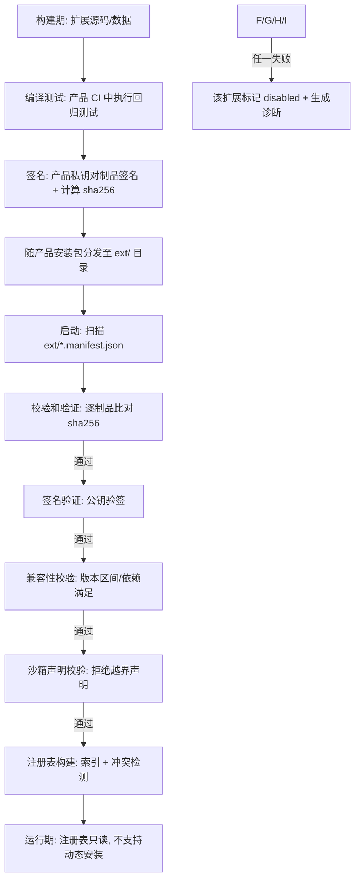

# 04 受控注册表与诊断体系设计

> 版本: 0.1(草案)
> 状态: 设计规格
> 适用范围: IES Plan 综合能源规划软件(backend/frontend 全栈)
> 配套文档: docs/spec/ 系列(01 数据库 schema、02 计算模型、03 任务调度)

---

## 1. 概述

### 1.1 目标

本文档定义 IES Plan 的**受控扩展体系**与**诊断/帮助/消息体系**:

1. **受控注册表(Controlled Registry)**:设备、算法、指标、数据源、单位、表达式函数六类扩展的登记、校验、加载机制。扩展仅可来自产品安装包内、经过测试与签名校验的受控代码,杜绝用户上传任意代码、杜绝扩展访问用户会话/任意 DB 连接/任意服务器路径。
2. **表达式引擎(Restricted Expression Engine)**:受限语法 + 白名单函数的安全计算管线。
3. **诊断体系(Diagnostics)**:稳定诊断码、严重程度、阻断性、中英消息键、对象定位、修复建议、关联标识。后端只产数据与消息键,不硬编码 UI 文案。
4. **帮助体系(Help)**:稳定帮助主题,中英双语、离线可读,通过元数据键与页面/按钮/参数/诊断关联。
5. **模型精度(Model Precision)**:1/2/3 三级精度,精度选择不影响数据、权限与结果追踪。
6. **单位注册(Unit Registry)**:六类单位,SI 基准、换算系数、中英显示格式、量纲运算。
7. **中英消息键目录(Message Key Catalog)**:JSON 模板 + 40 个以上具体消息键。

### 1.2 原则

| 编号 | 原则 | 说明 |
|---|---|---|
| P1 | 受控即安全 | 扩展代码随产品安装、经校验和/签名验证,启动时整体校验,运行期不再加载新代码 |
| P2 | 最小权限 | 扩展运行在沙箱进程/受限接口内;无会话访问、无任意 DB 连接、无任意路径读写 |
| P3 | 后端不发文案 | 后端诊断与错误只输出 `code` + `message_key` + `params`,文案由前端按 locale 渲染 |
| P4 | 一切可追溯 | 诊断、计算、精度选择均携带稳定标识,可回溯到版本、对象、字段、时间 |
| P5 | 离线可用 | 帮助与文案资源随产品离线打包,支持中英切换 |
| P6 | 精度正交 | 精度等级只影响求解模型,不改动数据、权限、结果追踪规则 |

### 1.3 术语

| 术语 | 含义 |
|---|---|
| 扩展(Extension) | 注册表中登记的受控能力单元(设备类型、算法、指标等) |
| 注册项(Entry) | 扩展在注册表中的一条记录 |
| 诊断(Diagnostic) | 一条用户可见的问题/提示数据,含稳定代码与消息键 |
| 消息键(Message Key) | 文案资源的稳定标识,形如 `ies.diag.data.ts_dup` |
| 帮助主题(Help Topic) | 稳定的帮助内容单元,形如 `help.modeling.load_node` |
| 精度等级(Precision Level) | 1=简化线性、2=标准、3=详细非线性 |

---

## 2. 受控注册表

### 2.1 注册表数据结构

注册表由多个注册项构成,每个注册项结构统一,按 `type` 区分能力类别。

```json
{
  "schema_version": 1,
  "registry_id": "ies.core.registry.v1",
  "created_by": "ies-core@1.0.0",
  "entries": [
    {
      "type": "device_type",                 // device_type | algorithm | metric | data_source | unit | expression_function
      "id": "ies.device.electric_grid_connection",
      "display_name": {"zh": "电网连接", "en": "Grid Connection"},
      "version": "1.2.0",
      "declared_capabilities": ["grid_connection", "power_balance_node"],
      "extends": null,                       // 继承的基类注册项 id,如 "ies.device.base"
      "compatible_versions": {
        "ies.core": ">=1.0.0,<2.0.0",
        "ies.solver.linear": ">=1.0.0"
      },
      "parameter_schema": {                  // 见 §3;JSON Schema 子集
        "type": "object",
        "properties": {
          "max_import_power_kw": {
            "type": "number",
            "unit": "kW",
            "min": 0,
            "max": 100000,
            "default": 0,
            "is_optimization_variable": false,
            "help_key": "help.param.grid.max_import_power_kw"
          }
        },
        "required": ["max_import_power_kw"]
      },
      "migration": {                         // 跨版本迁移规则
        "from_versions": ["1.1.0", "1.0.0"],
        "steps": [
          {"from": "1.1.0", "to": "1.2.0",
           "actions": [
             {"op": "rename_param", "old": "max_power_kw", "new": "max_import_power_kw"},
             {"op": "convert_unit", "param": "storage_capacity", "from_unit": "kWh", "to_unit": "kWh", "factor": 1.0}
           ]}
        ],
        "fallback": "reject"                 // reject | warn_drop | auto_convert
      },
      "sandbox": {                           // 沙箱声明(§2.4)
        "requires_io": false,
        "requires_network": false,
        "requires_db": false,
        "requires_session": false,
        "allowed_files": ["package_data/coefficients/*.csv"],
        "max_memory_mb": 256,
        "max_cpu_ms": 5000
      },
      "checksum": "sha256:ab12...",          // 与安装包内制品对应
      "signature": "base64:...",             // 产品私钥签名
      "help_topic": "help.device.grid_connection",
      "enabled": true
    }
  ]
}
```

**注册项字段总表**

| 字段 | 必填 | 类型 | 说明 |
|---|---|---|---|
| type | 是 | enum | 六类之一,见 §2.3 |
| id | 是 | string | 稳定标识,`ies.<类>.<名字>`,全小写、用 `.` 分隔,不得变更 |
| display_name | 是 | {zh, en} | 显示名(中英) |
| version | 是 | semver | 语义化版本 `x.y.z` |
| declared_capabilities | 是 | string[] | 能力清单,如 `grid_connection`、`controllable`、`storage`;能力名须在 `ies.capability` 能力字典中登记 |
| extends | 否 | string | 继承的基类注册项,继承参数与默认行为 |
| compatible_versions | 是 | object | 与 `ies.core` 等核心组件及依赖扩展的版本兼容区间(语义化版本范围) |
| parameter_schema | 是 | object | JSON Schema 子集 + 单位/范围/默认/优化变量/帮助键扩展(§3) |
| migration | 是 | object | 从旧版本升级的字段迁移规则 |
| sandbox | 是 | object | 沙箱能力声明,违反则拒绝加载(§2.4) |
| checksum / signature | 是 | string | 制品完整性校验(§2.2) |
| help_topic | 否 | string | 关联帮助主题(§6) |
| enabled | 是 | bool | 是否启用 |

### 2.2 注册与加载流程

**总体流程:产品安装时随包安装 → 签名与校验和验证 → 启动时校验 → 运行期只读。**



关键规则:

1. **随产品安装**:扩展制品打包在产品安装目录 `ext/` 下,每扩展一个目录:
   ```
   ext/
   └── ies.device.heat_pump/
       ├── manifest.json      # 注册项元数据(§2.1 中 entries[].id 对应的条目)
       ├── package.sha256
       ├── package.sig
       └── lib/               # 编译后代码(无源码分发)
   ```
2. **签名与校验和**:制品发布前由产品 CI 用私钥签名;启动时用内置公钥验签,并比对 sha256。任何篡改 → 加载失败,发出 `SEC-REG-001` 阻断诊断。
3. **启动时校验**:完整性 → 签名 → 版本兼容 → 沙箱声明 → 依赖解析(拓扑序)→ 冲突检测(同 id 双版本 → 拒绝)。全部通过才进入注册表索引。
4. **运行期只读**:进程启动后注册表不可增删改;禁止运行时 `dlopen`/热加载/从用户目录加载。用户项目文件只能引用注册表中已存在的 id,不能携带扩展本体。
5. **注册表快照**:每次启动生成 `registry_snapshot.json`(所有 id+版本+sha256 的列表),写入日志并供计算快照引用(§7.3),保证可复现。

### 2.3 类型目录(六类注册项)

| type | 注册项内容 | id 前缀 | 示例 | 可被谁引用 |
|---|---|---|---|---|
| device_type | 设备类型定义(参数 schema、行为、精度差异 §7.2) | `ies.device.*` | `ies.device.pv`, `ies.device.battery` | 项目中的设备实例 |
| algorithm | 求解/评估算法(线性、非线性、不确定性) | `ies.algo.*` | `ies.algo.lp_simplex`, `ies.algo.milp_cbc`, `ies.algo.mc_sampling` | 规划任务配置 |
| metric | 指标定义(经济、能效、碳排放等) | `ies.metric.*` | `ies.metric.lcoe`, `ies.metric.self_sufficiency` | 结果面板、报告 |
| data_source | 数据源适配器(气象、负荷、电价) | `ies.ds.*` | `ies.ds.weather_tmy`, `ies.ds.csv_import` | 数据导入流程 |
| unit | 单位定义(§8) | `ies.unit.*` | `ies.unit.kwh`, `ies.unit.cny` | 全部参数/结果 |
| expression_function | 表达式引擎白名单函数(§4.3) | `ies.fn.*` | `ies.fn.abs`, `ies.fn.agg_monthly` | 表达式引擎 |

**能力字典 `ies.capability`(节选)**:`grid_connection`(电网连接)、`controllable`(可控)、`storage`(储能)、`pv`(光伏)、`thermal_generation`(产热)、`cooling_generation`(产冷)、`heat_pump`(热泵)、`dual_hvac`(冷热两用)、`load`(负荷)、`switchable`(可关断)、`optimization_variable`(参与优化)。

### 2.4 扩展权限边界

扩展(含表达式引擎)的**硬约束**,启动校验时逐条检查,任一不满足即拒绝加载:

| 禁止项 | 说明 | 违规诊断码 |
|---|---|---|
| 会话访问 | 不能访问用户会话、token、用户目录 | `SEC-REG-002` |
| 任意 DB 连接 | 不能建立数据库连接;数据访问必须走内核提供的数据接口(只读、限列、限行) | `SEC-REG-003` |
| 任意服务器路径 | 文件访问仅限本扩展目录与内核显式授权的临时目录 | `SEC-REG-004` |
| 任意代码执行 | 不执行用户上传代码;表达式走受限语法(§4) | `SEC-REG-005` |
| 网络访问 | 默认禁止出网;需要外部数据必须声明 `requires_network` 并走产品内置数据源适配器 | `SEC-REG-006` |
| 反射/动态加载 | 禁止 `dlopen`、反射调用内核内部 API;只能调用内核公开的扩展接口(Interface) | `SEC-REG-007` |

实现形态:扩展代码编译后运行于**独立进程 + 受限系统调用(seccomp/沙箱容器)**,与内核间仅通过版本化的 RPC/数据接口通信;UI 侧扩展仅允许声明式配置,不允许脚本。

---

## 3. 设备类型注册示例

参数 schema 约定:每个参数含 `name`、`unit`(注册单位 id)、`min/max`、`default`、`stock_or_addition`(存量/新增)、`is_optimization_variable`(可否作为优化变量)、`help_key`(帮助主题键)、`precision_override`(可选,精度差异,见 §7.2)。

任务清单中共列出 9 种设备,全部给出完整 schema(注:任务原文写"8 种",实际括号内为 9 项,以 9 项为准;其中冷负荷与热负荷共用负荷类 schema,冷热组合以 `dual_hvac` 能力表达)。

### 3.1 公共基类 `ies.device.base`

所有设备继承:`name`(字符串)、`enabled`、`priority`(0-1000)、`connect_node`(网络节点)、`annualized_flag`。

```json
{
  "type": "device_type",
  "id": "ies.device.base",
  "version": "1.0.0",
  "parameter_schema": {
    "type": "object",
    "properties": {
      "name": {"type": "string", "maxLength": 128, "help_key": "help.param.common.name"},
      "enabled": {"type": "boolean", "default": true, "help_key": "help.param.common.enabled"},
      "priority": {"type": "number", "min": 0, "max": 1000, "default": 100, "is_optimization_variable": false, "help_key": "help.param.common.priority"},
      "connect_node": {"type": "string", "help_key": "help.param.common.connect_node"}
    },
    "required": ["name", "connect_node"]
  }
}
```

### 3.2 电网连接 `ies.device.grid_connection`

```json
{
  "type": "device_type",
  "id": "ies.device.grid_connection",
  "version": "1.2.0",
  "declared_capabilities": ["grid_connection", "power_balance_node"],
  "extends": "ies.device.base",
  "parameter_schema": {
    "type": "object",
    "properties": {
      "max_import_power_kw":   {"type": "number", "unit": "kW",  "min": 0, "max": 200000, "default": 0,       "stock_or_addition": "stock",     "is_optimization_variable": true,  "help_key": "help.param.grid.max_import_power_kw"},
      "max_export_power_kw":   {"type": "number", "unit": "kW",  "min": 0, "max": 200000, "default": 0,       "stock_or_addition": "stock",     "is_optimization_variable": true,  "help_key": "help.param.grid.max_export_power_kw"},
      "voltage_level_kv":      {"type": "number", "unit": "kV",  "enum": [0.4, 10, 35, 110], "default": 10,  "stock_or_addition": "stock",     "is_optimization_variable": false, "help_key": "help.param.grid.voltage_level_kv"},
      "import_tariff":         {"type": "object", "unit": "CNY/kWh", "min": 0, "default": {"peak": 1.1, "flat": 0.7, "valley": 0.3}, "stock_or_addition": "stock", "is_optimization_variable": false, "help_key": "help.param.grid.import_tariff"},
      "export_tariff":         {"type": "number", "unit": "CNY/kWh", "min": 0, "default": 0.35, "stock_or_addition": "stock", "is_optimization_variable": false, "help_key": "help.param.grid.export_tariff"},
      "demand_charge":         {"type": "number", "unit": "CNY/kW·月", "min": 0, "default": 40, "stock_or_addition": "stock", "is_optimization_variable": false, "help_key": "help.param.grid.demand_charge"}
    },
    "required": ["max_import_power_kw"]
  }
}
```

### 3.3 光伏 `ies.device.pv`

```json
{
  "type": "device_type",
  "id": "ies.device.pv",
  "version": "1.3.0",
  "declared_capabilities": ["pv", "controllable", "optimization_variable"],
  "extends": "ies.device.base",
  "parameter_schema": {
    "type": "object",
    "properties": {
      "rated_capacity_kwp":    {"type": "number", "unit": "kWp", "min": 0, "max": 1000000, "default": 0,    "stock_or_addition": "addition", "is_optimization_variable": true,  "help_key": "help.param.pv.rated_capacity_kwp"},
      "max_capacity_kwp":      {"type": "number", "unit": "kWp", "min": 0, "max": 1000000, "default": 1000, "stock_or_addition": "addition", "is_optimization_variable": false, "help_key": "help.param.pv.max_capacity_kwp"},
      "efficiency":            {"type": "number", "unit": "-",   "min": 0.05, "max": 0.5,  "default": 0.20, "stock_or_addition": "stock",     "is_optimization_variable": false, "help_key": "help.param.pv.efficiency"},
      "tilt_deg":              {"type": "number", "unit": "deg", "min": 0, "max": 90,    "default": 30,    "stock_or_addition": "stock",     "is_optimization_variable": false, "help_key": "help.param.pv.tilt_deg"},
      "azimuth_deg":           {"type": "number", "unit": "deg", "min": 0, "max": 360,   "default": 180,   "stock_or_addition": "stock",     "is_optimization_variable": false, "help_key": "help.param.pv.azimuth_deg"},
      "unit_invest_cost":      {"type": "number", "unit": "CNY/kWp", "min": 0, "default": 3500, "stock_or_addition": "addition", "is_optimization_variable": false, "help_key": "help.param.pv.unit_invest_cost"},
      "lifetime_years":        {"type": "number", "unit": "a", "min": 1, "max": 50, "default": 25, "stock_or_addition": "stock", "is_optimization_variable": false, "help_key": "help.param.pv.lifetime_years"}
    },
    "required": ["max_capacity_kwp"]
  }
}
```

### 3.4 电池 `ies.device.battery`

```json
{
  "type": "device_type",
  "id": "ies.device.battery",
  "version": "1.4.0",
  "declared_capabilities": ["storage", "controllable", "optimization_variable"],
  "extends": "ies.device.base",
  "parameter_schema": {
    "type": "object",
    "properties": {
      "capacity_kwh":          {"type": "number", "unit": "kWh", "min": 0, "max": 10000000, "default": 0,   "stock_or_addition": "addition", "is_optimization_variable": true,  "help_key": "help.param.battery.capacity_kwh"},
      "max_capacity_kwh":      {"type": "number", "unit": "kWh", "min": 0, "max": 10000000, "default": 5000,"stock_or_addition": "addition", "is_optimization_variable": false, "help_key": "help.param.battery.max_capacity_kwh"},
      "rated_power_kw":        {"type": "number", "unit": "kW",  "min": 0, "max": 1000000,  "default": 0,   "stock_or_addition": "addition", "is_optimization_variable": true,  "help_key": "help.param.battery.rated_power_kw"},
      "charge_efficiency":     {"type": "number", "unit": "-",   "min": 0.5, "max": 1.0, "default": 0.95, "stock_or_addition": "stock",     "is_optimization_variable": false, "help_key": "help.param.battery.charge_efficiency"},
      "discharge_efficiency":  {"type": "number", "unit": "-",   "min": 0.5, "max": 1.0, "default": 0.95, "stock_or_addition": "stock",     "is_optimization_variable": false, "help_key": "help.param.battery.discharge_efficiency"},
      "max_soc":               {"type": "number", "unit": "-",   "min": 0.5, "max": 1.0, "default": 0.90, "stock_or_addition": "stock",     "is_optimization_variable": false, "help_key": "help.param.battery.max_soc"},
      "min_soc":               {"type": "number", "unit": "-",   "min": 0,   "max": 0.5, "default": 0.1,  "stock_or_addition": "stock",     "is_optimization_variable": false, "help_key": "help.param.battery.min_soc"},
      "initial_soc":           {"type": "number", "unit": "-",   "min": 0,   "max": 1.0, "default": 0.5,  "stock_or_addition": "stock",     "is_optimization_variable": false, "help_key": "help.param.battery.initial_soc"},
      "cycle_life":            {"type": "number", "unit": "次",   "min": 100, "max": 20000, "default": 6000,"stock_or_addition": "stock",     "is_optimization_variable": false, "help_key": "help.param.battery.cycle_life"},
      "unit_invest_cost":      {"type": "number", "unit": "CNY/kWh", "min": 0, "default": 900, "stock_or_addition": "addition", "is_optimization_variable": false, "help_key": "help.param.battery.unit_invest_cost"},
      "lifetime_years":        {"type": "number", "unit": "a", "min": 1, "max": 50, "default": 10, "stock_or_addition": "stock", "is_optimization_variable": false, "help_key": "help.param.battery.lifetime_years"}
    },
    "required": ["max_capacity_kwh"]
  }
}
```

### 3.5 电负荷 `ies.device.electric_load`

```json
{
  "type": "device_type",
  "id": "ies.device.electric_load",
  "version": "1.1.0",
  "declared_capabilities": ["load", "switchable"],
  "extends": "ies.device.base",
  "parameter_schema": {
    "type": "object",
    "properties": {
      "peak_power_kw":         {"type": "number", "unit": "kW", "min": 0, "max": 10000000, "default": 0, "stock_or_addition": "stock", "is_optimization_variable": false, "help_key": "help.param.load.peak_power_kw"},
      "load_profile":          {"type": "reference", "ref_type": "time_series", "required": true, "help_key": "help.param.load.load_profile"},
      "annual_energy_kwh":     {"type": "number", "unit": "kWh", "min": 0, "default": 0, "stock_or_addition": "stock", "is_optimization_variable": false, "help_key": "help.param.load.annual_energy_kwh"},
      "is_switchable":         {"type": "boolean", "default": false, "stock_or_addition": "stock", "is_optimization_variable": false, "help_key": "help.param.load.is_switchable"}
    },
    "required": ["load_profile"]
  }
}
```

### 3.6 热负荷 `ies.device.heat_load`(负荷类公共 schema)

```json
{
  "type": "device_type",
  "id": "ies.device.heat_load",
  "version": "1.1.0",
  "declared_capabilities": ["load", "heat_load"],
  "extends": "ies.device.base",
  "parameter_schema": {
    "type": "object",
    "properties": {
      "peak_heat_kw":          {"type": "number", "unit": "kW", "min": 0, "max": 10000000, "default": 0, "stock_or_addition": "stock", "is_optimization_variable": false, "help_key": "help.param.heatload.peak_heat_kw"},
      "heat_profile":          {"type": "reference", "ref_type": "time_series", "required": true, "help_key": "help.param.heatload.heat_profile"},
      "annual_heat_kwh":       {"type": "number", "unit": "kWh", "min": 0, "default": 0, "stock_or_addition": "stock", "is_optimization_variable": false, "help_key": "help.param.heatload.annual_heat_kwh"},
      "supply_temp_c":         {"type": "number", "unit": "°C", "min": 30, "max": 95, "default": 70, "stock_or_addition": "stock", "is_optimization_variable": false, "help_key": "help.param.heatload.supply_temp_c"},
      "return_temp_c":         {"type": "number", "unit": "°C", "min": 10, "max": 70, "default": 50, "stock_or_addition": "stock", "is_optimization_variable": false, "help_key": "help.param.heatload.return_temp_c"}
    },
    "required": ["heat_profile"]
  }
}
```

### 3.7 冷负荷(冷热组合)`ies.device.cooling_load`

冷热组合:同一设备实例可同时具备 `cooling_load` 与 `heat_load` 能力(dual_hvac 场景),用 `mode` 参数区分供冷/供热/冷热联供。

```json
{
  "type": "device_type",
  "id": "ies.device.cooling_load",
  "version": "1.1.0",
  "declared_capabilities": ["load", "cooling_load", "dual_hvac"],
  "extends": "ies.device.base",
  "parameter_schema": {
    "type": "object",
    "properties": {
      "mode":                 {"type": "string", "enum": ["cooling_only", "heating_only", "cooling_heating_combo"], "default": "cooling_only", "stock_or_addition": "stock", "is_optimization_variable": false, "help_key": "help.param.coolingload.mode"},
      "peak_cooling_kw":      {"type": "number", "unit": "kW", "min": 0, "max": 10000000, "default": 0, "stock_or_addition": "stock", "is_optimization_variable": false, "help_key": "help.param.coolingload.peak_cooling_kw"},
      "cooling_profile":      {"type": "reference", "ref_type": "time_series", "required": true, "help_key": "help.param.coolingload.cooling_profile"},
      "annual_cooling_kwh":   {"type": "number", "unit": "kWh", "min": 0, "default": 0, "stock_or_addition": "stock", "is_optimization_variable": false, "help_key": "help.param.coolingload.annual_cooling_kwh"},
      "supply_temp_c":        {"type": "number", "unit": "°C", "min": 3, "max": 20, "default": 7, "stock_or_addition": "stock", "is_optimization_variable": false, "help_key": "help.param.coolingload.supply_temp_c"},
      "return_temp_c":        {"type": "number", "unit": "°C", "min": 7, "max": 30, "default": 12, "stock_or_addition": "stock", "is_optimization_variable": false, "help_key": "help.param.coolingload.return_temp_c"}
    },
    "required": ["cooling_profile"]
  }
}
```

### 3.8 热泵 `ies.device.heat_pump`

```json
{
  "type": "device_type",
  "id": "ies.device.heat_pump",
  "version": "1.3.0",
  "declared_capabilities": ["heat_pump", "controllable", "dual_hvac", "optimization_variable"],
  "extends": "ies.device.base",
  "parameter_schema": {
    "type": "object",
    "properties": {
      "rated_heat_kw":         {"type": "number", "unit": "kW", "min": 0, "max": 1000000, "default": 0,  "stock_or_addition": "addition", "is_optimization_variable": true,  "help_key": "help.param.heatpump.rated_heat_kw"},
      "max_heat_kw":           {"type": "number", "unit": "kW", "min": 0, "max": 1000000, "default": 1000,"stock_or_addition": "addition", "is_optimization_variable": false, "help_key": "help.param.heatpump.max_heat_kw"},
      "cop":                   {"type": "number", "unit": "-",  "min": 2.0, "max": 6.5, "default": 3.2, "stock_or_addition": "stock",     "is_optimization_variable": false, "help_key": "help.param.heatpump.cop"},
      "cop_profile":           {"type": "reference", "ref_type": "time_series", "help_key": "help.param.heatpump.cop_profile"},
      "source_type":           {"type": "string", "enum": ["air", "ground", "water"], "default": "air", "stock_or_addition": "stock", "is_optimization_variable": false, "help_key": "help.param.heatpump.source_type"},
      "mode":                  {"type": "string", "enum": ["heating", "cooling", "both"], "default": "both", "stock_or_addition": "stock", "is_optimization_variable": false, "help_key": "help.param.heatpump.mode"},
      "unit_invest_cost":      {"type": "number", "unit": "CNY/kW", "min": 0, "default": 1800, "stock_or_addition": "addition", "is_optimization_variable": false, "help_key": "help.param.heatpump.unit_invest_cost"},
      "lifetime_years":        {"type": "number", "unit": "a", "min": 1, "max": 50, "default": 20, "stock_or_addition": "stock", "is_optimization_variable": false, "help_key": "help.param.heatpump.lifetime_years"}
    },
    "required": ["max_heat_kw"]
  }
}
```

### 3.9 燃气锅炉 `ies.device.gas_boiler`

```json
{
  "type": "device_type",
  "id": "ies.device.gas_boiler",
  "version": "1.2.0",
  "declared_capabilities": ["thermal_generation", "controllable", "optimization_variable"],
  "extends": "ies.device.base",
  "parameter_schema": {
    "type": "object",
    "properties": {
      "rated_heat_kw":         {"type": "number", "unit": "kW", "min": 0, "max": 1000000, "default": 0,   "stock_or_addition": "addition", "is_optimization_variable": true,  "help_key": "help.param.boiler.rated_heat_kw"},
      "max_heat_kw":           {"type": "number", "unit": "kW", "min": 0, "max": 1000000, "default": 1000, "stock_or_addition": "addition", "is_optimization_variable": false, "help_key": "help.param.boiler.max_heat_kw"},
      "thermal_efficiency":    {"type": "number", "unit": "-",  "min": 0.5, "max": 1.0, "default": 0.90, "stock_or_addition": "stock",     "is_optimization_variable": false, "help_key": "help.param.boiler.thermal_efficiency"},
      "gas_price":             {"type": "number", "unit": "CNY/m³", "min": 0, "default": 3.2, "stock_or_addition": "stock", "is_optimization_variable": false, "help_key": "help.param.boiler.gas_price"},
      "lhv_kj_per_m3":         {"type": "number", "unit": "kJ/m³", "min": 10000, "max": 60000, "default": 35900, "stock_or_addition": "stock", "is_optimization_variable": false, "help_key": "help.param.boiler.lhv_kj_per_m3"},
      "unit_invest_cost":      {"type": "number", "unit": "CNY/kW", "min": 0, "default": 600, "stock_or_addition": "addition", "is_optimization_variable": false, "help_key": "help.param.boiler.unit_invest_cost"},
      "lifetime_years":        {"type": "number", "unit": "a", "min": 1, "max": 50, "default": 15, "stock_or_addition": "stock", "is_optimization_variable": false, "help_key": "help.param.boiler.lifetime_years"}
    },
    "required": ["max_heat_kw"]
  }
}
```

### 3.10 电制冷机 `ies.device.electric_chiller`

```json
{
  "type": "device_type",
  "id": "ies.device.electric_chiller",
  "version": "1.2.0",
  "declared_capabilities": ["cooling_generation", "controllable", "optimization_variable"],
  "extends": "ies.device.base",
  "parameter_schema": {
    "type": "object",
    "properties": {
      "rated_cooling_kw":      {"type": "number", "unit": "kW", "min": 0, "max": 1000000, "default": 0,   "stock_or_addition": "addition", "is_optimization_variable": true,  "help_key": "help.param.chiller.rated_cooling_kw"},
      "max_cooling_kw":        {"type": "number", "unit": "kW", "min": 0, "max": 1000000, "default": 1000, "stock_or_addition": "addition", "is_optimization_variable": false, "help_key": "help.param.chiller.max_cooling_kw"},
      "cop":                   {"type": "number", "unit": "-",  "min": 1.5, "max": 8.0, "default": 4.0, "stock_or_addition": "stock",     "is_optimization_variable": false, "help_key": "help.param.chiller.cop"},
      "cop_profile":           {"type": "reference", "ref_type": "time_series", "help_key": "help.param.chiller.cop_profile"},
      "cooling_temp_c":        {"type": "number", "unit": "°C", "min": 3, "max": 20, "default": 7, "stock_or_addition": "stock", "is_optimization_variable": false, "help_key": "help.param.chiller.cooling_temp_c"},
      "unit_invest_cost":      {"type": "number", "unit": "CNY/kW", "min": 0, "default": 1200, "stock_or_addition": "addition", "is_optimization_variable": false, "help_key": "help.param.chiller.unit_invest_cost"},
      "lifetime_years":        {"type": "number", "unit": "a", "min": 1, "max": 50, "default": 18, "stock_or_addition": "stock", "is_optimization_variable": false, "help_key": "help.param.chiller.lifetime_years"}
    },
    "required": ["max_cooling_kw"]
  }
}
```

**存量/新增说明**:`stock_or_addition` = `stock` 表示既有设备(容量固定),`addition` 表示可规划新增(容量为优化变量,受 `max_*` 上限约束)。`is_optimization_variable: true` 的参数会被求解器纳入决策变量(容量类,如电池容量);运行类决策(逐时出力)由内核按设备能力自动生成,不在此参数层面声明。

---

## 4. 表达式引擎

### 4.1 受限语法(BNF 摘要)

```
expr        := additive
additive    := multiplicative (('+' | '-') multiplicative)*
multiplicative := unary (('*' | '/' | '//' | '%') unary)*
unary       := ('-' | '+') unary | power
power       := atom ('^' atom)?
atom        := NUMBER | STRING? | IDENT | FUNCALL | '(' expr ')'
funcall     := IDENT '(' arglist? ')'
arglist     := expr (',' expr)*
IDENT       := [a-zA-Z_][a-zA-Z0-9_]*     // 仅白名单函数名或已注册变量名
NUMBER      := [0-9]+('.'[0-9]+)?([eE][+-]?[0-9]+)?
```

约束:

- **仅**代数运算(四则、取模、整除、幂)与比较(在 `if()`/`when()` 函数内),无赋值语句、无循环、无函数定义、无字符串拼接/插值。
- 变量只能引用**显式声明的上下文变量**(参数、时序列列、指标),变量名需在内核登记的 `expr_context` 中,否则报 `EXPR-CODE-001`。
- 时间聚合函数参数必须是注册的时间聚合标签(`hourly`/`daily`/`monthly`/`annual`)。
- 不支持位运算、不支持三目之外的任何控制流。

### 4.2 处理流水线

```
源码字符串
  → 1) 词法/语法解析(PEG, AST 上限 512 节点,深度上限 32)
     失败 → EXPR-SYN-001(带行/列位置)
  → 2) 类型检查:每节点推导类型(number | boolean | series | agg_result)
     失败 → EXPR-TYP-001
  → 3) 量纲检查:每节点推导量纲(见 §8.3;series 与 number 运算需维度一致或显式常数无量纲)
     失败 → EXPR-DIM-001
  → 4) 范围检查:常量字面量区间、除数非零(符号分析)、幂指数范围
     失败 → EXPR-RNG-001
  → 5) 白名单/禁止名单扫描:函数名、标识符集合
     失败 → EXPR-SEC-001
  → 6) 编译为受限 IR(无回调、无闭包逃逸),缓存
  → 7) 运行:纯函数求值,超时(默认 50ms/表达式)、内存上限(1MB)、数值陷阱(溢出→NaN 拒绝)
     失败 → EXPR-RUN-001
```

四阶段检查的典型报错示例:

```json
{
  "code": "EXPR-DIM-001",
  "message_key": "ies.expr.dim_mismatch",
  "params": {"left": "kWh", "right": "kW", "node": "binary_op.*"},
  "severity": "error",
  "blocking": true,
  "location": {"object_type": "formula", "object_id": "calc.lcoe", "field": "expression"}
}
```

### 4.3 函数白名单

函数本身作为 `expression_function` 类型注册进注册表(§2.3),运行时从注册表加载,不允许出现注册表之外的调用名。

**数学函数**

| 函数 | 说明 | 返回量纲 |
|---|---|---|
| `abs(x)` | 绝对值 | 同 x |
| `min(a,b,...)` / `max(a,b,...)` | 多参最小/最大 | 同参数 |
| `clamp(x, lo, hi)` | 限幅 | 同 x |
| `sin(x)` / `cos(x)` | 三角函数,x 为角度(deg) | 无量纲 |
| `exp(x)` / `ln(x)` / `log10(x)` | 指数/对数 | 无量纲 |
| `sqrt(x)` | 平方根 | sqrt(量纲) |
| `pow(x, n)` | 幂,n 为常数 | x^n 量纲 |
| `round(x, n)` / `floor(x)` / `ceil(x)` | 取整 | 同 x |
| `if(cond, a, b)` | 条件选择,cond 为比较表达式 | a/b 量纲一致 |

**时间聚合函数**

| 函数 | 说明 |
|---|---|
| `agg_sum(s, 'monthly')` | 按时段求和 |
| `agg_avg(s, 'daily')` | 按时段平均 |
| `agg_max(s, 'annual')` / `agg_min(s, ...)` | 按时段极值 |
| `agg_first(s, ...)` / `agg_last(s, ...)` | 时段首/末值 |
| `shift(s, n)` | 时序列平移 n 步(仅用于相对历史) |
| `peak_hours(s, threshold)` | 超过阈值的时段计数 |

**禁止列表(显式拒绝,不进入注册表)**

| 类别 | 名称/模式 | 说明 |
|---|---|---|
| 动态执行 | `eval`、`exec`、`compile`、`new Function`、`vm.runIn*`、`eval_*` | 任意代码执行 |
| 导入/反射 | `import`、`require`、`__import__`、`getattr`、`globals()`、`locals()` | 加载任意模块/反射访问 |
| IO | `open`、`read`、`write`、`print`、`input`、`file` | 文件/控制台 IO |
| 网络 | `socket`、`http`、`fetch`、`urllib`、`requests` | 出网 |
| 系统/进程 | `os`、`subprocess`、`system`、`popen`、`env`、`sleep` | 进程与系统调用 |
| 字符串执行 | 任何含 `import`/`eval` 字样标识符的调用 | 混淆手段一律拒绝 |
| 内建逃逸 | `__class__`、`__globals__`、`__subclasses__`、属性访问 `.` 链中访问 `_` 前缀成员 | 内建对象逃逸 |

### 4.4 安全评估

| 攻击面 | 防护措施 | 结论 |
|---|---|---|
| 任意代码执行 | 受限语法+AST 白名单+禁止名单双扫描;AST 不做 `eval` 直接解释,而是编译为受限 IR | 阻断 |
| 拒绝服务(死循环/超算) | 无循环语法;节点数/深度上限;IR 步数上限(10 万步);50ms 超时 | 阻断 |
| 资源耗尽(内存) | 中间值 1MB 上限;不允许分配集合类型(无 list/dict 字面量) | 阻断 |
| 数据泄露(读文件/环境变量) | 无 IO 语法;上下文变量白名单;沙箱进程无文件句柄 | 阻断 |
| 网络外联 | 无网络语法;沙箱网络 namespace 关闭 | 阻断 |
| 类型混淆攻击 | 静态类型+量纲检查在运行前完成;数值陷阱(溢出/NaN/除零)运行期拒绝 | 阻断 |
| 时序侧信道 | 表达式结果不携带执行耗时(不向表达式暴露计时 API) | 低风险 |
| 函数注册表污染 | 函数只能来自签名校验过的注册表(`ies.fn.*`),无法运行时注册 | 阻断 |
| 残留风险 | 复杂表达式组合导致的求解误差、聚合语义歧义 | 属模型风险,由诊断与文档提示,非安全风险 |

结论:表达式引擎可安全接受来自项目文件(用户输入)的表达式,满足"不执行用户上传的任意代码"约束。表达式仅保存于项目内,不属于可分发扩展。

---

## 5. 诊断体系

### 5.1 诊断码命名规范

格式:`<域>-<类别>-<三位序号>`,大写。

| 域 | 含义 | 类别示例 |
|---|---|---|
| DATA | 数据(时序列、导入) | TS 时序列、COL 列、VAL 值、FORM 格式 |
| CONN | 连接(网络/拓扑/接线) | TYPE 类型、NODE 节点、MISS 缺失 |
| PARAM | 参数校验 | RNG 范围、UNIT 单位、CONF 冲突 |
| TASK | 任务(规划/计算) | QUEUE 队列、SOLVE 求解、TIMEOUT 超时 |
| RES | 结果 | NUM 数值、MISS 缺失、RANGE 越界 |
| SEC | 安全/注册 | REG 注册、AUTH 认证 |
| EXPR | 表达式引擎 | SYN 语法、TYP 类型、DIM 量纲、RNG 范围、SEC 安全、RUN 运行、CODE 上下文 |
| PERM | 权限 | DENIED 拒绝、ROLE 角色 |
| SYS | 系统 | STORE 存储、CFG 配置 |

示例:`DATA-TS-001`(时序列重复)、`CONN-TYPE-002`(设备类型未注册)、`PARAM-RNG-003`(参数越界)、`TASK-SOLVE-001`(求解失败)、`EXPR-SEC-001`(表达式含禁止函数)、`RES-MISS-002`(结果缺失)。

**规范细则**

1. 码一旦发布即永久稳定,不得复用、不得改名(废弃仅允许标记 `deprecated`,新码另发)。
2. 语义:域-类别表达"发生在哪、是什么",序号表达"具体哪一条";新诊断加序号,不改变既有码。
3. 诊断码与消息键一一对应:码 `DATA-TS-001` ↔ 消息键 `ies.diag.data.ts_dup`(`<域>.<类别>.<snake 名称>`)。
4. 向后兼容:消息键只增不改;文案可改,键不变。

### 5.2 严重程度

| 级别 | 枚举值 | 含义 | UI 行为 | blocking |
|---|---|---|---|---|
| 阻断 | `blocking` | 流程无法继续(如注册校验失败、求解器不可用) | 阻止提交/运行 | true |
| 错误 | `error` | 当前操作失败但系统可用(如参数校验失败、单文件导入失败) | 操作中止,可修改后重试 | false(默认) |
| 警告 | `warning` | 结果可能受影响但不中断(如数据缺失插补、精度降级) | 提示条 + 结果标记 | false |
| 信息 | `info` | 正常提示(如任务排队、计算完成) | 静默/通知 | false |

`blocking` 为独立布尔,与 severity 正交(通常 blocking 只见于 blocking/error,但允许 warn 级带 blocking 的罕见情形,如"警告但不允许继续")。

### 5.3 消息键目录结构

消息键层级:`ies.diag.<域>.<类别>.<名称>`:

```
ies.diag.
├── data.
│   ├── ts_dup          DATA-TS-001
│   ├── ts_gap          DATA-TS-002
│   ├── ts_leap         DATA-TS-003
│   ├── col_missing     DATA-COL-001
│   └── ...
├── conn.
│   ├── type_unregistered  CONN-TYPE-002
│   ├── node_orphan        CONN-NODE-001
│   └── ...
├── param.
│   ├── rng_out           PARAM-RNG-003
│   └── ...
├── task.
│   ├── solve_failed      TASK-SOLVE-001
│   └── ...
├── res.
│   └── ...
├── sec.
│   └── ...
└── perm.
    └── ...
```

### 5.4 诊断对象 JSON 结构

后端统一产出诊断对象(数组),前端按 locale + message_key + params 渲染文案:

```json
{
  "code": "DATA-TS-001",
  "message_key": "ies.diag.data.ts_dup",
  "params": {
    "series_name": "electric_load_2025",
    "count": 2,
    "first_rows": [3, 178]
  },
  "severity": "error",
  "blocking": false,
  "location": {
    "object_type": "time_series",
    "object_id": "ts.electric_load_2025",
    "field": "rows",
    "row": [3, 178]
  },
  "fix_hint_key": "ies.fix.data.ts_dup",
  "ref_ids": ["DATA-TS-001", "help.import.csv_duplicate_rows"],
  "occurred_at": "2026-08-18T10:32:07Z",
  "source": "import.csv",
  "trace_id": "trc-8f3a...",
  "project_id": "prj-001",
  "suppressed": false
}
```

字段说明:

| 字段 | 必填 | 说明 |
|---|---|---|
| code | 是 | 稳定诊断码(§5.1) |
| message_key | 是 | 文案键,唯一对应 code |
| params | 否 | 文案插值参数(如数值、名称),只含可序列化数据 |
| severity | 是 | blocking/error/warning/info |
| blocking | 是 | 是否阻断当前操作 |
| location | 是 | 定位:object_type(项目/设备/参数/时序列/结果/任务)、object_id、field、row(可选) |
| fix_hint_key | 否 | 修复建议文案键(独立于消息键,便于单独维护) |
| ref_ids | 否 | 关联标识:相关诊断码、帮助主题键、来源资源 id |
| occurred_at | 是 | 产生时间(UTC ISO8601) |
| source | 否 | 产生环节(如 import.csv / solve.milp / registry.boot) |
| trace_id | 否 | 链路追踪 id |
| project_id / task_id | 否 | 上下文归属 |
| suppressed | 否 | 是否被用户忽略(本地状态,不入库时可为 null) |

**规则**:后端/内核**不输出任何人类可读文案字符串**,只输出 message_key + params;文案仅存在于前端 locale 资源(§9)。诊断对象需可序列化(JSON)、可入库(审计)、可跨版本保留(code 稳定)。

---

## 6. 帮助主题目录

### 6.1 帮助主题命名规范

格式:`help.<领域>.<主题>`,全部小写、`.` 分隔;参数级主题再加 `.param` 与参数名:

```
help.
├── modeling.       建模(节点、设备、拓扑)
├── connection.     连接(电气/热力/网络)
├── import.         数据导入(CSV/气象/电价)
├── validation.     校验
├── param.          参数(每个注册参数的帮助)
├── config.         规划配置(时段、目标、算法、精度)
├── task.           任务(排队、运行、监控)
├── result.         结果(图表、报告)
├── validity.       四维有效性(数据/模型/求解/结果)
├── uncertainty.    不确定性分析
├── export.         导出(报告、数据)
├── project.        项目包(打包/迁移/还原)
├── account.        账号
├── permission.     权限
└── offline.        离线使用
```

命名细则:主题名与注册项/参数/诊断通过**元数据键**关联,键即 id 本身(`help.param.grid.max_import_power_kw` = 注册参数 `grid_connection.max_import_power_kw` 的帮助)。主题文件:每主题一个 markdown,位于 `docs/help/<zh|en>/<topic>.md`,随产品离线打包。

### 6.2 核心主题清单

| 主题键 | 内容(中英双语) |
|---|---|
| help.modeling.project_overview | 项目总览:结构、层级、生命周期 |
| help.modeling.load_node | 负荷节点建模 |
| help.modeling.grid_connection | 电网连接配置(含尖峰/平/谷电价、需量电费) |
| help.modeling.pv | 光伏建模(容量、倾角、效率) |
| help.modeling.battery | 电池建模(容量、SOC 约束、寿命) |
| help.modeling.heat_pump | 热泵建模(COP、冷热双模式) |
| help.connection.electric_network | 电气网络连接规则 |
| help.connection.thermal_network | 热力网络连接规则 |
| help.import.csv_general | CSV 导入通用规则 |
| help.import.weather | 气象数据导入(TMY/CSV) |
| help.import.tariff | 电价数据导入 |
| help.import.duplicate_rows | 重复行处理(与 DATA-TS-001 关联) |
| help.validation.basics | 校验流程与诊断解读 |
| help.validation.data_validation | 数据校验范围 |
| help.param.common.* | 公共参数帮助(每个参数一个) |
| help.config.time_horizon | 时间粒度与规划周期配置 |
| help.config.objectives | 优化目标配置 |
| help.config.algorithm | 算法选择 |
| help.config.precision | 模型精度等级选择(§7) |
| help.task.overview | 任务中心概述 |
| help.task.lifecycle | 任务生命周期(排队→求解→完成/失败) |
| help.task.inspect_diag | 查看任务诊断 |
| help.result.overview | 结果总览(能流、经济、排放) |
| help.result.charts | 图表解读 |
| help.result.report | 报告生成 |
| help.validity.four_dimensions | 四维有效性:数据有效性、模型有效性、求解有效性、结果有效性 |
| help.uncertainty.overview | 不确定性分析(蒙特卡洛/敏感性) |
| help.export.report | 导出报告 |
| help.export.data | 导出原始数据 |
| help.project.package | 项目包打包/导入 |
| help.project.migration | 项目版本迁移 |
| help.account.login | 登录 |
| help.account.profile | 个人资料 |
| help.permission.roles | 角色与权限模型 |
| help.permission.project_share | 项目共享 |
| help.offline.usage | 离线模式使用说明 |
| help.offline.resources | 离线资源包(文案/帮助)更新 |

### 6.3 主题与页面/参数/诊断的关联方式

统一通过**元数据键**关联,不依赖硬编码路径:

1. **页面 → 主题**:页面元数据 `help_key: "help.modeling.pv"`,前端"?"按钮取键渲染。
2. **参数 → 主题**:注册项参数 schema 中 `help_key` 字段(§3),表单控件点击帮助图标即打开对应主题。
3. **诊断 → 主题**:诊断对象 `ref_ids` 中携带 `help.*` 键(§5.4),诊断面板"查看帮助"跳转。
4. **错误 → 主题**:错误响应体(§9 消息键)由 `ies.msg.*` 键前缀映射到 `help.*`(约定:错误键 `ies.msg.err.*` 对应 `help.*` 同名域)。
5. **主题间**:主题 front-matter 声明 `see_also` 列表,支持离线全文检索索引(`help/index.json` 随包生成)。

示例元数据声明(页面 JSON):

```json
{
  "route": "/modeling/device/pv",
  "help_key": "help.modeling.pv",
  "related_keys": ["help.param.pv.rated_capacity_kwp", "help.param.pv.efficiency"]
}
```

---

## 7. 模型精度

### 7.1 精度等级定义

| 等级 | 名称 | 代号 | 适用场景 | 典型求解器 |
|---|---|---|---|---|
| 1 | 简化线性 | P1 · `linear_simplified` | 方案预筛选、大规模系统快速估算 | LP(线性规划) |
| 2 | 标准 | P2 · `standard` | 常规规划设计 | MILP(混合整数线性规划) |
| 3 | 详细非线性 | P3 · `detailed_nonlinear` | 精细校验、可研深度分析 | NLP/迭代 MIP + 校验 |

**正交性(P6)**:精度选择只改变**求解模型的生成方式**;不改变:(a) 项目数据(时序列、参数原始值),(b) 权限与角色规则,(c) 结果追踪规则(所有等级结果均写结果日志,带 `precision_level` 标记,见 §7.3)。

### 7.2 每级对设备模型的差异

以 §3 设备为例(内核在生成模型时按精度切换):

| 设备 | 等级 1(简化线性) | 等级 2(标准) | 等级 3(详细非线性) |
|---|---|---|---|
| 电网连接 | 单一分时电价,无需量费;功率无界内线性 | 峰平谷电价 + 需量费;功率上下限 | 分时电价曲线 + 需量费 + 功率因数约束 |
| 光伏 | 效率常数,输出 = 容量 × 常数辐照系数 | 逐时辐照 × 效率,线性化 | 温度-辐照双变量效率模型(非线性) |
| 电池 | 能量平衡 + 单效率,线性化 | 充放电分效率、SOC 上下限、初终 SOC 约束 | 效率随 SOC/倍率变化的非线性模型 + 寿命退化 |
| 电/热/冷负荷 | 固定曲线,不可调 | 曲线 + 可平移时段(整数变量) | 曲线 + 弹性质(价格响应) |
| 热泵 | COP 常数,产热 = COP × 电耗 | COP 逐时曲线(分模式) | COP 随源/供水温度变化的非线性模型 |
| 燃气锅炉 | 效率常数,燃料 = 热量/效率 | 效率曲线 + 最小出力/启停整数变量 | 部分负荷效率曲线 + 启停成本(非线性) |
| 电制冷机 | COP 常数 | COP 逐时 + 最小出力 | COP 随冷冻水/冷却水温度非线性 |

表达方式:设备注册项可含 `precision_override` 段(如 §2.1 参数 schema 的扩展),声明某参数在等级 3 下使用另一单位/上限,或者设备 manifest 中提供三个等级对应的模型生成器 id。未声明差异的设备各等级模型相同。

### 7.3 精度元数据进入计算快照

每次计算任务生成**计算快照**(不可变),其中包含精度信息,保证结果可复现与追溯:

```json
{
  "snapshot_id": "snap-20260818-0042-7f3a",
  "created_at": "2026-08-18T10:42:00Z",
  "project_id": "prj-001",
  "project_version_id": 14,          // 字段命名对齐 01-db-schema.md §7.1 calc_snapshots
  "dataset_version_ids": [9],        // 同上:绑定的数据集版本 id 数组
  "random_seed": 42,                 // 同上:随机种子(快照强制非 NULL)
  "precision": {
    "level": 2,
    "name": "standard",
    "solver": "ies.algo.milp_cbc@2.1.0",
    "selected_by": {"user_id": "u-7", "time": "2026-08-18T10:41:20Z"},
    "selected_scope": {"scope": "project", "device_overrides": {"dev-12": 3}}
  },
  "registry_snapshot": ["ies.device.pv@1.3.0", "ies.algo.milp_cbc@2.1.0", "ies.unit.kwh@1.0.0"],
  "data_snapshot": {"hash": "sha256:...", "series_version": 9}
}
```

规则:

1. 精度选择可按**项目级**或**设备级**覆盖(`selected_scope`),设备级覆盖只允许选择 ≥ 项目级? 不——**任意方向都允许**,但覆盖必须显式声明,快照记录每个设备的最终生效精度。
2. 快照与结果绑定:每条结果记录(§诊断、指标、曲线)携带 `snapshot_id` 与 `precision.level`。
3. 结果报告必须显示"计算所用精度等级",避免跨等级结果误比较;跨等级比较时内核产生 `RES-RANGE-004`(warn)提示。
4. 精度不改变数据权限与追踪:快照仍完整记录访问该数据所需的一切审计信息(谁、何时、何数据版本)。

---

## 8. 单位注册

### 8.1 单位类别与 SI 基准

单位作为 `ies.unit.*` 注册项(§2.3)。类别、SI 基准与换算系数:

| 类别 | 类 id | SI 基准 | 注册单位示例 | 换算系数(→SI) |
|---|---|---|---|---|
| 能量 | `energy` | J(焦耳) | `ies.unit.j`, `ies.unit.kj`, `ies.unit.mj`, `ies.unit.gj`, `ies.unit.kwh`, `ies.unit.mwh`, `ies.unit.gwh`, `ies.unit.kcal` | 1 kJ=1000 J;1 kWh=3.6e6 J;1 kcal=4186.8 J |
| 功率 | `power` | W(瓦特) | `ies.unit.w`, `ies.unit.kw`, `ies.unit.mw`, `ies.unit.gw` | 1 kW=1000 W;1 MW=1e6 W |
| 温度 | `temperature` | K(开尔文) | `ies.unit.k`, `ies.unit.c`(摄氏度), `ies.unit.f` | °C→K: +273.15;°F→K: (f+459.67)×5/9 |
| 金额 | `currency` | CNY(人民币元) | `ies.unit.cny`, `ies.unit.usd`, `ies.unit.cny_per_kwh`(派生), `ies.unit.cny_per_kwp` | 汇率由项目配置给定(非固定换算) |
| 时长 | `duration` | s(秒) | `ies.unit.s`, `ies.unit.min`, `ies.unit.h`, `ies.unit.a`(年,8760 h) | 1 min=60 s;1 h=3600 s;1 a=8760 h |
| 角度 | `angle` | rad(弧度) | `ies.unit.rad`, `ies.unit.deg` | 1 deg=π/180 rad |

### 8.2 单位定义 JSON 与展示格式

```json
{
  "type": "unit",
  "id": "ies.unit.kwh",
  "version": "1.0.0",
  "category": "energy",
  "base_unit": "ies.unit.j",
  "conversion": {"factor": 3600000.0, "offset": 0.0, "note": "1 kWh = 3.6e6 J"},
  "display": {
    "zh": {"symbol": "千瓦时", "short": "kWh", "format": "{0:g} kWh", "group_sep": "千分位"},
    "en": {"symbol": "kWh", "short": "kWh", "format": "{0:g} kWh"}
  },
  "aliases": ["kwh", "千瓦时", "度"],
  "precision_digits": 2,
  "help_key": "help.unit.kwh"
}
```

**单位匹配与别名**:解析用户输入(如 CSV 表头"电量(kWh)")时,用别名表归一化;无匹配时报 `DATA-COL-002` 并给出建议单位。

### 8.3 量纲运算规则

量纲以"基单位幂次"表示:能量 `[E^1]`、功率 `[E^1 T^-1]`、时长 `[T^1]`、温度 `[Θ^1]`、金额 `[M0]`(独立轴)、角度 `[1]`(无量纲,可参与三角函数的自变量)。(轴与 02 计算模型文档 §2.1 的 7 维 SI 基 M/L/T/Θ/I/N/J 一致,能量轴 E ≡ M·L²·T⁻²,此处为业务简写。)

```json
{
  "dimension": {"J": 1, "s": -1, "K": 0, "CNY": 0},
  "example_power": {"J": 1, "s": -1}
}
```

运算规则:

1. 加减:两侧量纲必须完全相同(温度例外:摄氏度与开尔文加减用温差语义,需显式 `delta_t` 标记),否则 `EXPR-DIM-001` / `PARAM-UNIT-002`。
2. 乘除:量纲按指数相加/相减;结果量纲为分数时(如 `kWh/h`)自动匹配注册的复合单位(`ies.unit.kwh_per_h` 即 kW)。
3. 幂:仅指数为常数且结果可归一化到注册单位时才接受。
4. 温度:摄氏度是仿射单位(含偏移),只允许(a) 与另一个温度做差得温差 K;(b) 与温差做加减;(c) 直接赋值显示。禁止直接相乘或作为比值分母。
5. 角度:三角函数参数必须是角度类;sin/cos 结果无量纲。
6. 换算只在**同类单位**间进行;跨类(如 kW 与 kWh 相加)一律拒绝,报错含两个量纲详情。
7. 数值运算在内部统一为 SI 基单位执行,仅在展示/导出时转换为目标单位;时序列列在导入时声明单位并统一换算存储。

---

## 9. 中英消息键目录

### 9.1 消息键 JSON 模板

所有用户可见文案经消息键索引,存放于前端资源 `locales/zh-CN.json` 与 `locales/en-US.json`(离线打包)。键分五大类前缀:

```
ies.msg.      通用消息(登录、导航、操作)
ies.diag.     诊断消息(§5,与诊断码一一对应)
ies.fix.      修复建议(§5.4 fix_hint_key)
ies.expr.     表达式引擎错误
ies.help.     帮助(备用锚点,主内容在 docs/help)
```

模板条目结构:

```json
{
  "ies.msg.auth.login_ok": {
    "zh": "登录成功，欢迎回来 {name}",
    "en": "Signed in successfully. Welcome back, {name}.",
    "params": ["name"],
    "severity_hint": "success"
  }
}
```

参数命名:插值参数用 `{name}` 形式,参数名须与诊断对象 `params` 字段一致;文案不得内嵌 HTML(一律为纯文本,富文本由前端组件提供),杜绝拼接注入。

### 9.2 具体消息键示例(≥ 40 条,中英各一)

**A. 登录/账号(6 条)**

| 消息键 | code | 中文 | 英文 |
|---|---|---|---|
| ies.msg.auth.login_ok | - | 登录成功,欢迎回来 {name} | Signed in successfully. Welcome back, {name}. |
| ies.msg.auth.login_failed | - | 用户名或密码错误 | Incorrect username or password. |
| ies.msg.auth.session_expired | - | 登录已过期,请重新登录 | Your session has expired. Please sign in again. |
| ies.msg.auth.account_locked | - | 账户已锁定,请 {minutes} 分钟后再试 | Account locked. Try again in {minutes} minutes. |
| ies.msg.auth.password_weak | - | 密码强度不足:至少 {min} 个字符并包含字母与数字 | Password too weak: at least {min} characters with letters and digits. |
| ies.msg.auth.password_reset_sent | - | 重置链接已发送至 {email} | A reset link has been sent to {email}. |

**B. 校验/参数(11 条)**

| 消息键 | code | 中文 | 英文 |
|---|---|---|---|
| ies.diag.data.ts_dup | DATA-TS-001 | 时序列 {series_name} 存在 {count} 处重复时间戳 | Time series {series_name} has {count} duplicate timestamps. |
| ies.diag.data.ts_gap | DATA-TS-002 | 时序列 {series_name} 在 {from} 与 {to} 之间存在缺口,已按插值补齐 | Time series {series_name} has a gap between {from} and {to}; gaps were filled by interpolation. |
| ies.diag.data.col_missing | DATA-COL-001 | 缺少必需列 {col},期望列: {expected} | Missing required column {col}. Expected columns: {expected}. |
| ies.diag.data.col_unit_unknown | DATA-COL-002 | 无法识别列 {col} 的单位 {unit_text},请选择单位 | Cannot recognize the unit {unit_text} of column {col}. Please choose a unit. |
| ies.diag.conn.type_unregistered | CONN-TYPE-002 | 设备 {device_id} 的类型 {type_id} 未在注册表中注册 | The type {type_id} of device {device_id} is not registered. |
| ies.diag.conn.node_orphan | CONN-NODE-001 | 设备 {device_id} 未连接到任何节点 | Device {device_id} is not connected to any node. |
| ies.diag.param.rng_out | PARAM-RNG-003 | 参数 {param} 取值 {value} 超出范围 [{min}, {max}] | Parameter {param} value {value} is out of range [{min}, {max}]. |
| ies.diag.param.unit_mismatch | PARAM-UNIT-002 | 参数 {param} 单位不匹配:期望 {expected},实际 {actual} | Unit mismatch for {param}: expected {expected}, got {actual}. |
| ies.diag.param.conflict | PARAM-CONF-001 | 参数 {p1} 与 {p2} 相互冲突,不能同时满足 | Parameters {p1} and {p2} conflict and cannot both hold. |
| ies.expr.dim_mismatch | EXPR-DIM-001 | 表达式 {expr} 中运算 {op} 两侧量纲不一致:{left} 与 {right} | In expression {expr}, operator {op} has mismatched dimensions: {left} vs {right}. |
| ies.diag.data.ts_leap | DATA-TS-003 | 时序列 {series_name} 含闰日(2 月 29 日),标准日历不接受 366 天 | Time series {series_name} contains a leap day (Feb 29); the standard calendar accepts no 366-day years. |

**C. 任务(12 条)**

| 消息键 | code | 中文 | 英文 |
|---|---|---|---|
| ies.diag.task.queued | - | 任务 {task_id} 已加入队列 | Task {task_id} is queued. |
| ies.diag.task.running | - | 任务 {task_id} 正在求解(算法 {algo},精度等级 {precision}) | Task {task_id} is running ({algo}, precision level {precision}). |
| ies.diag.task.solve_failed | TASK-SOLVE-001 | 任务 {task_id} 求解失败:{reason} | Task {task_id} failed to solve: {reason}. |
| ies.diag.task.timeout | TASK-TIMEOUT-001 | 任务 {task_id} 超过求解时限 {seconds} 秒 | Task {task_id} exceeded the solve time limit of {seconds} seconds. |
| ies.diag.task.infeasible | TASK-SOLVE-002 | 任务 {task_id} 无可行解:请检查容量约束与平衡约束 | Task {task_id} is infeasible. Check capacity and balance constraints. |
| ies.diag.task.cancel_ok | - | 任务 {task_id} 已取消 | Task {task_id} has been cancelled. |
| ies.diag.task.cancel_denied | - | 任务 {task_id} 已完成,无法取消 | Task {task_id} has finished and cannot be cancelled. |
| ies.diag.task.progress | - | 任务 {task_id} 进度 {percent}% | Task {task_id} progress: {percent}%. |
| ies.diag.task.completed | - | 任务 {task_id} 已完成 | Task {task_id} completed. |
| ies.diag.task.snapshot_missing | TASK-DATA-001 | 无法重现任务 {task_id}:计算快照缺失 | Cannot reproduce task {task_id}: computation snapshot is missing. |
| ies.diag.task.snapshot_hash_mismatch | TASK-DATA-002 | 任务 {task_id} 计算快照哈希校验失败,无法重现 | Task {task_id} snapshot hash verification failed; cannot reproduce. |
| ies.diag.task.base_infeasible | TASK-SOLVE-003 | 任务 {task_id} 基准方案无可行解:请新增设备或显式开启削减 | Task {task_id} baseline is infeasible: add devices or explicitly enable load shedding. |

**D. 结果(8 条)**

| 消息键 | code | 中文 | 英文 |
|---|---|---|---|
| ies.diag.res.result_ready | - | 结果已生成,共 {count} 项指标 | Results ready: {count} metrics computed. |
| ies.diag.res.metric_missing | RES-MISS-002 | 指标 {metric_id} 无结果,原因:{reason} | Metric {metric_id} has no result: {reason}. |
| ies.diag.res.out_of_range | RES-RANGE-001 | 指标 {metric_id} 数值 {value} 超出物理合理区间 [{min}, {max}] | Metric {metric_id} value {value} is outside the physically plausible range [{min}, {max}]. |
| ies.diag.res.precision_mismatch | RES-RANGE-004 | 结果 {res_a}(精度 {pa})与 {res_b}(精度 {pb})精度不同,请勿直接比较 | Result {res_a} (precision {pa}) and {res_b} (precision {pb}) differ in precision; do not compare directly. |
| ies.diag.res.uncertainty_bounds | - | 指标 {metric_id} 置信区间(P95):[{lo}, {hi}] | Metric {metric_id} P95 confidence interval: [{lo}, {hi}]. |
| ies.diag.res.invalid_nan | RES-NUM-001 | 指标 {metric_id} 产生非数值结果,已置空 | Metric {metric_id} produced a non-numeric value and was set to null. |
| ies.diag.res.export_ok | - | 报告已导出至 {path} | Report exported to {path}. |
| ies.diag.res.export_failed | - | 导出失败:{reason} | Export failed: {reason}. |

**E. 存储/项目(8 条)**

| 消息键 | code | 中文 | 英文 |
|---|---|---|---|
| ies.diag.store.save_ok | - | 项目已保存(版本 {version}) | Project saved (version {version}). |
| ies.diag.store.save_conflict | - | 保存冲突:项目已在其他会话中修改,请刷新后合并 | Save conflict: the project was modified elsewhere. Refresh and merge. |
| ies.diag.store.open_failed | - | 打开项目失败:{reason} | Failed to open project: {reason}. |
| ies.diag.store.corrupt | SYS-STORE-001 | 项目文件损坏,已尝试自动修复并生成备份 | Project file is corrupted; an automatic repair was attempted and a backup was created. |
| ies.diag.store.migration_needed | - | 项目格式版本 {from} 需升级至 {to},将自动迁移 | Project format {from} needs migration to {to}; migration will run automatically. |
| ies.diag.store.migration_failed | SYS-STORE-002 | 项目迁移失败:{reason};已保留原始文件 | Project migration failed: {reason}. The original file was kept. |
| ies.diag.store.package_ok | - | 项目包已生成:{path} | Project package created: {path}. |
| ies.diag.store.quota_exceeded | SYS-STORE-003 | 存储空间不足:需要 {need} MB,可用 {avail} MB | Insufficient storage: {need} MB required, {avail} MB available. |

**F. 安全/权限/表达式(6 条)**

| 消息键 | code | 中文 | 英文 |
|---|---|---|---|
| ies.diag.sec.registry_integrity | SEC-REG-001 | 扩展 {ext_id} 校验失败(校验和或签名不匹配),已禁用 | Extension {ext_id} failed integrity verification (checksum or signature) and was disabled. |
| ies.diag.sec.sandbox_violation | SEC-REG-005 | 扩展 {ext_id} 声明了超出沙箱边界的能力,已拒绝加载 | Extension {ext_id} declares capabilities beyond the sandbox boundary and was rejected. |
| ies.expr.forbidden_fn | EXPR-SEC-001 | 表达式 {expr} 调用了禁止函数 {fn} | Expression {expr} calls the forbidden function {fn}. |
| ies.expr.syntax_error | EXPR-SYN-001 | 表达式语法错误:第 {line} 行第 {col} 列 | Expression syntax error at line {line}, column {col}. |
| ies.diag.perm.denied | PERM-DENIED-001 | 无权限执行操作 {action} | No permission to perform {action}. |
| ies.diag.perm.role_changed | - | 角色已变更为 {role},权限已更新 | Role changed to {role}; permissions updated. |

合计:6+11+12+8+8+6 = 51 条,满足"至少 40 条"要求,覆盖登录、校验、任务、结果、存储五大类(另含安全/权限/表达式类)。

---

## 10. 附录:设计检查对照表

| 系统约束 | 落点 |
|---|---|
| 扩展声明标识、版本、兼容性、能力、单位、参数、迁移规则 | §2.1 注册项字段;§3 设备 schema;§8 单位定义 |
| 扩展不能访问用户会话、任意 DB 连接、任意服务器路径 | §2.4 权限边界(硬约束 + 沙箱) |
| 只加载随产品安装并测试的受控扩展 | §2.2 随包安装、签名/校验和、启动校验、注册表只读 |
| 不执行用户上传任意代码;表达式受限语法 + 白名单函数 | §4 表达式引擎(语法/流水线/白名单/禁止列表/安全评估) |
| 每条诊断有稳定代码、严重程度、阻断、中英消息键、对象/字段/时间位置、修复建议、关联标识 | §5 诊断体系(§5.1 码、§5.2 严重度、§5.3 键目录、§5.4 JSON 结构) |
| 后端只提供诊断数据和消息键,不硬编码 UI 文案 | §5.4 规则;§9 文案全部在前端 locale 资源 |
| 帮助:核心页面/按钮/参数/错误/结果有稳定帮助主题,中英双语、离线可读 | §6 帮助主题目录(§6.1 命名、§6.2 清单、§6.3 元数据关联、离线打包) |
| 精度选择不改变数据、权限和结果追踪规则 | §7.1 正交性 P6;§7.3 快照记录精度但不改追踪规则 |
| 单位类别、SI 基准、换算、中英展示、量纲运算 | §8 单位注册 |
| 中英消息键目录 | §9(48 条示例) |

---

*文档结束。后续修订:登记变更于 docs/spec/CHANGELOG.md。*
